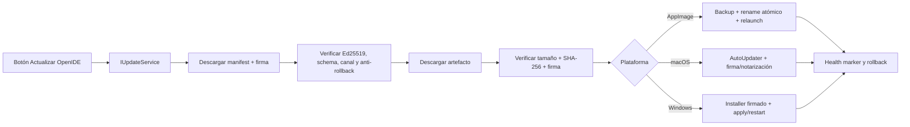

# Sistema propio de actualizaciones y branding integral de OpenIDE

## Contexto y decisiones

### Estado real encontrado

El repositorio ya tiene parte del camino hecho, pero el producto todavía mezcla tres capas distintas:

| Capa | Estado actual | Problema |
|---|---|---|
| Identidad del producto | `vscode/product.json` ya usa `OpenIDE`, IDs propios, protocolo `openide`, iconos propios y URLs de GitHub de OpenIDE | Persisten URLs Microsoft/VSCodium, textos heredados, fixtures, documentación, scripts y superficies visibles no auditadas |
| Runtime de updates | Conserva `IUpdateService`, `AbstractUpdateService` y estados de Code OSS; el feed fue parcheado a `https://raw.githubusercontent.com/Niiihuel/openide/updates/.../latest.json` | Linux sólo abre la página de releases; no descarga, verifica, reemplaza ni revierte AppImage. La UX sigue siendo genérica/heredada |
| Publicación | `.github/workflows/release-openide.yml` compila sólo Linux x64, publica release y genera un `latest.json` en la rama `updates` | No hay macOS/Windows, firma criptográfica del manifiesto, firma nativa, promoción stable/insider ni rollback de feed |
| Integridad | El manifest contiene SHA-1 y SHA-256; Windows verifica SHA-256 al descargar | El manifest no está autenticado. Un atacante que altere manifest + hash puede sustituir el artefacto |
| Versionado | `openide-version.json` separa versión OpenIDE, canal y base Code OSS; `version.sh` valida la línea API | Hay valores de build heredados/hardcodeados (`1.121.04319`) en templates generados y no existe una política completa de promoción de canales |
| AppImage/NixOS | `dev/build-appimage.sh` genera AppImage y `dev/install-appimage.sh` instala en `~/.local/bin/OpenIDE.AppImage` mediante wrapper `appimage-run` | El updater no sabe que esa instalación es mutable ni mantiene backup/rollback |
| UX | Comandos y menús existentes: check/download/install/restart; badges globales y release notes | Los nombres siguen siendo genéricos, el botón no es una superficie propia de OpenIDE y los estados no explican firma, canal, rollback ni método de instalación |

### Alcance aprobado

- Primera implementación funcional para **Linux, macOS y Windows**.
- Artefactos en **GitHub Releases** y manifests en la rama **`updates`** del mismo repositorio.
- Linux AppImage/NixOS: reemplazo automático atómico de `~/.local/bin/OpenIDE.AppImage`, backup y rollback.
- Branding: renombrar producto, documentación e infraestructura del repositorio, conservando únicamente identificadores upstream requeridos por compatibilidad o licencias.
- Canales `stable` e `insider` desde el contrato inicial.

### Firma elegida

Usar dos niveles complementarios:

1. **Minisign/Ed25519 para el contrato de actualización**:
   - clave pública embebida en `product.json` y en el runtime;
   - clave privada cifrada como secret de GitHub Actions;
   - firma detached de bytes canónicos del manifest;
   - manifiesto con SHA-256 y tamaño de cada artefacto;
   - implementación simple, auditable y sin depender de disponibilidad externa durante la actualización.
2. **Firma nativa de plataforma para distribución**:
   - macOS Developer ID + notarización;
   - Windows Authenticode;
   - AppImage con manifest Ed25519 + SHA-256; opcionalmente firma detached del propio archivo.

Sigstore/Cosign puede agregarse como prueba de procedencia de CI, pero no será la única raíz de confianza del cliente: la verificación offline de Ed25519 es más adecuada para el updater embebido.

### Arquitectura elegida

Reutilizar la máquina de estados y el IPC de `IUpdateService`, pero convertirla en infraestructura propia de OpenIDE. No crear un segundo updater paralelo.



### Manifest v2

Publicar una ruta por canal/plataforma/arquitectura/target:

```text
updates/{stable|insider}/{linux|darwin|win32}/{x64|arm64}/{target}/latest.json
updates/{stable|insider}/{linux|darwin|win32}/{x64|arm64}/{target}/latest.json.minisig
```

Linux AppImage usará target `appimage`; Windows conservará `user`, `system`, `msi` y `archive`; macOS usará `archive`. Para compatibilidad temporal, el generador podrá publicar también las rutas legacy sin target.

Campos mínimos versionados:

```json
{
  "schemaVersion": 2,
  "product": "openide",
  "channel": "stable",
  "platform": "linux",
  "architecture": "x64",
  "target": "appimage",
  "productVersion": "1.121.2",
  "buildVersion": "<commit derivado>",
  "codeOssVersion": "1.121.0",
  "publishedAt": "<ISO-8601>",
  "minimumUpdaterVersion": 1,
  "artifact": {
    "url": "https://github.com/Niiihuel/openide/releases/download/v1.121.2/OpenIDE-1.121.2-x86_64.AppImage",
    "size": 229927416,
    "sha256": "...",
    "signatureUrl": "...minisig"
  },
  "releaseNotesUrl": "https://github.com/Niiihuel/openide/releases/tag/v1.121.2",
  "rollout": { "percentage": 100, "seed": "1.121.2-stable" }
}
```

La firma cubre los bytes exactos de `latest.json`. El cliente no seguirá redirects a hosts fuera de una allowlist (`github.com`, `objects.githubusercontent.com`, `raw.githubusercontent.com`) salvo configuración explícita de desarrollo.

### Anti-rollback y recuperación

- Rechazar versiones inferiores o iguales a la instalada, salvo comando developer explícito.
- Persistir la mayor versión válida observada por canal.
- Rechazar un manifest stable que apunte a insider o a otro producto/plataforma/arquitectura/target.
- Mantener el artefacto actual como `.previous` y el nuevo como `.pending` hasta verificar y hacer `rename()` atómico.
- Escribir un marker de arranque pendiente con versión, hash, timestamp y backup.
- Considerar sano el update después de que el workbench llegue a `LifecyclePhase.Restored` y permanezca activo un período corto.
- Si el proceso nuevo termina antes del marker sano, el wrapper `~/.local/bin/openide` restaura `.previous` una sola vez y registra el motivo.
- Conservar sólo una versión anterior y limpiar `.pending` obsoletos.
- Nunca auto-modificar `/nix/store`: si OpenIDE fue instalado como derivation Nix, mostrar instrucción/acción adecuada. El reemplazo automático aplica al AppImage mutable detectado por `APPIMAGE` y por el wrapper OpenIDE.

### Experiencia propia de actualización

Agregar un **Centro de actualizaciones de OpenIDE** product-owned, accesible desde:

- botón con logo OpenIDE en el área global/account/status;
- `Ayuda > Actualizar OpenIDE…`;
- Command Palette `OpenIDE: Buscar actualizaciones`;
- notificación/badge cuando exista una versión.

Estados visibles:

| Estado | CTA principal |
|---|---|
| Idle | `Buscar actualizaciones` |
| Checking | spinner + `Buscando…` |
| Current | `OpenIDE está actualizado` |
| Available | versión, canal, notas y `Descargar` |
| Downloading | bytes/progreso + `Cancelar` |
| Verifying | `Verificando firma…` |
| Downloaded | `Instalar actualización` |
| Ready | `Reiniciar y actualizar` |
| Recovery available | `Restaurar versión anterior` |
| Error | motivo sanitizado + `Reintentar` / `Abrir diagnóstico` |

La superficie mostrará versión OpenIDE y base Code OSS por separado. No se mostrará “Code update”, “VSCodium update” ni URLs Microsoft.

Conservar aliases internos `update.*` donde sean contratos de Code OSS o extensiones, pero las acciones y labels públicas serán `openide.update.*`. Los aliases heredados delegarán al comando nuevo durante al menos una línea de versión.

### Política de canales y versionado

- Formato estable actual: `majorCodeOss.minorCodeOss.revisiónOpenIDE` (`1.121.2`).
- Insider: prerelease SemVer, por ejemplo `1.121.3-insider.20260722.1`.
- `openide-version.json` será la única fuente editable de versión/canal/base Code OSS.
- `version.sh` y tareas Gulp inyectarán esos valores sin literales versionados en source.
- Stable sólo puede promover un artefacto previamente aprobado y firmado.
- Insider publica en ruta y release prerelease separadas; un usuario stable no recibe insider salvo cambiar el canal explícitamente.
- Cambio de canal requiere confirmación y explica que insider puede actualizar con mayor frecuencia.

### Branding: qué se reemplaza y qué se conserva

**Reemplazar en producto y repositorio propio:**

- nombres VSCodium/Code OSS/VS Code usados como marca del producto;
- logos, app icons, splash/welcome, about, updater, instaladores, AppImage, desktop entries, protocol handler y assets de stores;
- URLs de documentación, release notes, integridad, issues, privacidad y soporte;
- scripts/workflows/docs que describen cómo construir o distribuir OpenIDE;
- nombres de jobs, assets y templates todavía llamados `vscodium` cuando son infraestructura propia;
- user agents de updater (`OpenIDE/<version>`), mensajes, categorías y telemetría local propia.

**Conservar por compatibilidad/legalidad:**

- namespace API `vscode`, esquema `vscode://` donde sea contrato de extensiones, comandos públicos `vscode.*` y `.vscode/` del workspace;
- IDs/publishers de extensiones upstream y referencias necesarias a su documentación;
- comentarios, fixtures, snapshots o tests que prueban compatibilidad upstream y no llegan al producto, marcándolos como upstream cuando corresponda;
- copyrights, MIT license, ThirdPartyNotices y atribuciones Microsoft/Code OSS/VSCodium;
- nombres de formatos/protocolos externos (`VSIX`, VS Code Extension API) cuando técnicamente corresponden.

No se hará reemplazo textual ciego: rompería APIs, extensiones, rutas y obligaciones legales. Se añadirá un audit automático que clasifique coincidencias permitidas y prohíba branding heredado en artefactos distribuidos.

## Archivos a tocar

### Contrato, runtime y seguridad

| Ruta | Cambio |
|---|---|
| `vscode/src/vs/platform/update/common/update.ts` | Extender `IUpdate`/state con schema v2, canal, target, tamaño, firma, fases verifying/recovery y progreso cancelable |
| `vscode/src/vs/platform/update/common/openideUpdateManifest.ts` **(nuevo)** | Tipos, validación estricta, canonicalización, SemVer, anti-rollback y allowlist de URLs |
| `vscode/src/vs/platform/update/node/openideUpdateVerifier.ts` **(nuevo)** | Verificación Ed25519/minisign, SHA-256, tamaño y errores sanitizados |
| `vscode/src/vs/platform/update/electron-main/abstractUpdateService.ts` | Descargar/verificar manifest firmado antes de cambiar a Available; persistir highest-seen, rollout y diagnóstico |
| `vscode/src/vs/platform/update/electron-main/updateService.linux.ts` | Reemplazar apertura del navegador por descarga AppImage, verificación, backup, rename atómico, permisos y relaunch; fallback explícito para Nix store/tarball |
| `vscode/src/vs/platform/update/electron-main/openideAppImageUpdater.ts` **(nuevo)** | Detección AppImage, paths `.pending/.previous`, fsync/rename, marker de salud y rollback |
| `vscode/src/vs/platform/update/electron-main/updateService.darwin.ts` | Consumir manifest firmado, validar zip/appcast y conservar autoUpdater sólo después de verificar metadata; integrar firma/notarización |
| `vscode/src/vs/platform/update/electron-main/updateService.win32.ts` | Exigir manifest firmado y SHA-256; mantener installer flow, Authenticode y recovery de paquetes pendientes |
| `vscode/src/vs/platform/update/electron-main/openideUpdateHealthService.ts` **(nuevo)** | Confirmar arranque sano, limpiar pending/backup y exponer recovery |
| `vscode/src/vs/platform/update/test/common/openideUpdateManifest.test.ts` **(nuevo)** | Schema, firma válida/inválida, downgrade, canal/plataforma, URLs y rollout |
| `vscode/src/vs/platform/update/test/node/openideUpdateVerifier.test.ts` **(nuevo)** | Vectores Ed25519, corrupción, truncamiento y firma de otra clave |
| `vscode/src/vs/platform/update/test/electron-main/openideAppImageUpdater.test.ts` **(nuevo)** | Atomicidad, permisos, backups, crash marker, rollback y cleanup con filesystem temporal |

### UX propia

| Ruta | Cambio |
|---|---|
| `vscode/src/vs/workbench/contrib/openideUpdate/browser/openideUpdateContribution.ts` **(nuevo)** | Registrar comandos `openide.update.*`, botón OpenIDE, badges, notificaciones y aliases legacy |
| `vscode/src/vs/workbench/contrib/openideUpdate/browser/openideUpdateCenter.ts` **(nuevo)** | Controlador del Centro de actualizaciones con estados, progreso, canal y recovery |
| `vscode/src/vs/workbench/contrib/openideUpdate/browser/openideUpdateCenterHtml.ts` **(nuevo)** | UI propia con logo, versión, firma, release notes, progreso y acciones |
| `vscode/src/vs/workbench/contrib/openideUpdate/browser/media/openideUpdate.css` **(nuevo)** | Estilos consistentes con Settings/Providers y estados accesibles |
| `vscode/src/vs/workbench/contrib/update/browser/update.contribution.ts` | Ocultar/aliasar acciones públicas heredadas sin romper contratos internos |
| `vscode/src/vs/workbench/contrib/update/browser/update.ts` | Reutilizar máquina de estados, retirar textos heredados visibles y delegar UX al centro OpenIDE |
| `vscode/src/vs/platform/menubar/electron-main/menubar.ts` | Menú `Actualizar OpenIDE…` y estados propios |
| `vscode/src/vs/workbench/browser/parts/titlebar/menubarControl.ts` | Acción/badge OpenIDE coherente en titlebar custom |
| `vscode/src/vs/workbench/contrib/openideUpdate/test/browser/openideUpdateCenter.test.ts` **(nuevo)** | Mapping estado→CTA, accesibilidad, progreso, errores y recovery |

### Release backend y empaquetado

| Ruta | Cambio |
|---|---|
| `openide-version.json` | Formalizar schema stable/insider, updater schema y versión mínima |
| `version.sh` | Derivar SemVer/canal/tag/build ID sin literales y validar promociones |
| `dev/generate-update-manifest.sh` | Generar manifest v2, tamaño/SHA-256, URLs `v<version>`, canonicalizar y firmar con Minisign |
| `dev/verify-update-manifest.sh` **(nuevo)** | Verificación local/CI con clave pública y descarga opcional del artefacto |
| `dev/build-appimage.sh` | Nombre/canal consistente, metadata de update y firma detached del AppImage |
| `dev/install-appimage.sh` | Instalar wrapper con health marker/rollback y paths estables consumidos por updater |
| `build.sh`, `dev/build.sh`, `prepare_assets.sh`, `release.sh` | Normalizar nombres OpenIDE, targets y checksums/firma por plataforma |
| `.github/workflows/release-openide.yml` | Matriz Linux/macOS/Windows x64/arm64; build, tests, firma nativa, notarización, release draft, manifests firmados y promoción atómica de `updates` |
| `.github/workflows/ci-openide.yml` | Tests del updater, audit de branding, build smoke de manifests y verificación de firma con clave de prueba |
| `.github/workflows/release-openide-insider.yml` **(nuevo)** | Publicación prerelease insider y feed separado |
| `.github/workflows/promote-openide.yml` **(nuevo)** | Promover release draft a stable sólo si todos los artefactos/firma/tests existen |
| `BUILD.md`, `README.md`, `docs/updates.md` **(nuevo)** | Operación de releases, rotación de claves, recuperación y soporte por plataforma |

### Branding y assets

| Ruta | Cambio |
|---|---|
| `vscode/product.json`, `product.json` | Eliminar URLs heredadas, agregar update public key/key ID, URLs OpenIDE, canales, privacidad y soporte |
| `icons/stable/*`, `icons/insider/*`, `icons/build_icons.sh` | Fuente única de logos stable/insider y generación reproducible de PNG/ICO/ICNS/BMP |
| `vscode/resources/linux/*` | Desktop, AppStream, Debian/RPM/Snap con OpenIDE y links propios |
| `vscode/resources/darwin/code.icns` | Icono OpenIDE y metadata de bundle |
| `vscode/resources/win32/code.ico`, PNGs y `inno-*.bmp` | Iconos/installer artwork OpenIDE |
| `stores/**` | Renombrar metadata de stores desde VSCodium/VS Code hacia OpenIDE |
| `prepare_vscode.sh` | Eliminar defaults VSCodium/Microsoft que hoy pueden reintroducir branding durante build |
| `vscode/src/vs/code/browser/workbench/callback.html` | Marca visible OpenIDE en callback web |
| `vscode/src/vs/platform/update/**`, `vscode/src/vs/workbench/contrib/update/**` | User agents, mensajes y categorías OpenIDE |
| `docs/**`, `.github/**`, scripts raíz | Reescribir documentación propia y workflows; archivar o etiquetar referencias upstream necesarias |
| `dev/audit-branding.mjs` **(nuevo)** | Escanear source y producto empaquetado con allowlist de compatibilidad/licencias |
| `dev/branding-allowlist.json` **(nuevo)** | Excepciones justificadas por path, patrón y motivo |

## Validación y revisión

### Runtime y seguridad

1. Tests con una keypair Ed25519 de fixture; la clave privada de producción nunca entra al repo ni a artifacts/logs.
2. Manifest válido, firma alterada, JSON reserializado, hash incorrecto, tamaño incorrecto, redirect hostil, downgrade, cross-channel y cross-platform.
3. Descarga interrumpida/reanudada, disco lleno, permisos insuficientes y conexión medida.
4. AppImage:
   - reemplazo atómico real en directorio temporal;
   - backup intacto si falla verificación;
   - rollback al simular crash antes del health marker;
   - no tocar `/nix/store`;
   - conservar settings/workspace.
5. macOS: `codesign --verify --deep --strict`, `spctl --assess`, notarización y update desde versión N-1.
6. Windows: `Get-AuthenticodeSignature`, installer user/system, permisos, UAC, update desde N-1 y recovery de pending.
7. Canal stable nunca consume insider; promoción prueba versión y firmas.
8. Release workflow falla cerrado si falta cualquier firma, checksum, asset o secret de producción.

### UX

- Snapshot/playwright del Centro de actualizaciones en cada estado.
- Botón visible con logo OpenIDE, teclado, lector de pantalla y foco.
- Progreso correcto y cancelación antes de instalación.
- Mensaje explícito para instalación Nix declarativa versus AppImage mutable.
- Errores sin stack/paths/secrets en UI; diagnóstico detallado sólo en Output > OpenIDE Update.
- Release notes y enlaces apuntan exclusivamente a OpenIDE.

### Audit de branding

Ejecutar el audit sobre:

1. código fuente propio;
2. `VSCode-linux-*`, `.app`, Windows package;
3. AppImage extraído;
4. desktop/AppStream/installer metadata;
5. menús, About, Help, Welcome, updater, issue reporter y callback web.

El audit debe fallar por VSCodium/Code OSS/Visual Studio Code en superficies distribuidas, excepto archivos de licencias/ThirdPartyNotices, nombres técnicos de API y extensiones upstream incluidos en allowlist.

### Foco de revisión adversarial

- actualización nunca ejecuta bytes sin firma/hash válidos;
- manifest no permite path traversal, downgrade ni cambio de host/canal;
- rollback no puede alternar infinitamente entre dos builds rotas;
- reemplazo AppImage no pierde el binario actual ante power loss;
- firma pública no puede reemplazarse desde el mismo manifest;
- release CI no expone private key en logs/caches/artifacts;
- aliases legacy no crean dos botones/updaters activos;
- renombrado no rompe Extension API, `vscode` namespace, URI schemes requeridos, marketplace Open VSX ni licencias.

## Límites de commit

1. **Contrato y seguridad:** manifest v2, verificador Ed25519, anti-rollback y tests. Sin UI ni instaladores.
2. **Linux/AppImage:** downloader, atomic replace, wrapper health/rollback y tests.
3. **macOS:** feed firmado, autoUpdater, codesign/notarización y tests de empaquetado.
4. **Windows:** feed firmado, installer/AuthentiCode, apply/recovery y tests.
5. **UX OpenIDE Update:** centro, botón, comandos, aliases y accesibilidad.
6. **Release CI:** matrices, signing, manifests, stable/insider y promoción.
7. **Branding de producto:** `product.json`, iconos y superficies visibles del runtime.
8. **Branding de packaging/stores:** Linux/macOS/Windows/store metadata.
9. **Docs e infraestructura:** README/docs/scripts/workflows y audit allowlist.

No mezclar la actualización funcional con reemplazos masivos de textos: cada commit debe compilar y ser revisable. No commitear `.build`, AppImages, certificados, claves, perfiles de notarización ni artifacts descargados.

## Riesgos y fuera de alcance

- Para publicar macOS y Windows con confianza real hacen falta credenciales externas todavía no presentes:
  - Apple Developer ID Application/Installer, notarization credentials y Team ID;
  - certificado Authenticode y acceso seguro desde Actions;
  - secret de la private key Minisign/Ed25519.
  El workflow se implementará fail-closed y documentará esos secrets; no producirá stable “firmado” si faltan.
- GitHub Raw puede tener cache temporal. La promoción escribirá manifests versionados primero y `latest.json` al final; el cliente tolerará cache por versión/timestamp.
- Nix declarativo no debe auto-modificarse. La experiencia automática garantizada será la instalación AppImage mutable; derivations mostrarán el mecanismo correcto.
- El primer updater firmado debe incluirse mediante una release bootstrap manual confiable. A partir de esa versión, todas las siguientes exigen firma.
- La rama `updates` no es raíz de confianza: sólo transporta manifests; la clave pública embebida es la raíz.
- Renombrar “todo” no significa borrar atribuciones ni cambiar contratos `vscode`. El audit documentará cada excepción.
- No se implementará delta update en la primera versión; artefactos completos reducen superficie de ataque. El schema deja espacio para deltas futuros.
- No se construirá un backend propio con base de datos: GitHub Releases + branch `updates` es suficiente para el alcance aprobado.

## Tareas

- [x] Formalizar schema v2 de manifest y política de versión/canales en `openide-version.json`.
- [x] Implementar parser estricto, canonicalización, verificación Ed25519 y anti-rollback con tests.
- [x] Extender `IUpdateService` y estados con verificación, progreso, cancelación y recovery.
- [x] Integrar manifest firmado en `AbstractUpdateService` y eliminar confianza directa en JSON/hash no autenticado.
- [x] Implementar descarga, reemplazo atómico, backup, health marker y rollback para AppImage/NixOS.
- [x] Adaptar el wrapper/instalador AppImage al protocolo de pending/previous/health.
- [x] Adaptar macOS al feed OpenIDE firmado, codesign, notarización y restart/install.
- [x] Adaptar Windows a manifests firmados, SHA-256 obligatorio, Authenticode y recovery.
- [x] Crear el Centro de actualizaciones y botón propio de OpenIDE con todos los estados y accesibilidad.
- [x] Registrar comandos `openide.update.*` y mantener aliases internos compatibles sin duplicar UX.
- [x] Rehacer el generador/publicador de manifests v2 y verificador local de releases.
- [x] Convertir release CI en matriz Linux/macOS/Windows x64/arm64 con artefactos y firmas obligatorias.
- [x] Agregar workflows separados de insider y promoción estable fail-closed.
- [x] Centralizar iconos stable/insider y regenerar assets Linux, macOS, Windows, AppImage e instaladores.
- [x] Sanear `product.json` y todas las URLs públicas hacia OpenIDE.
- [x] Renombrar superficies visibles, packaging, stores, docs y scripts propios desde VSCodium/Code OSS/VS Code a OpenIDE.
- [x] Crear audit automático de branding con allowlist documentada para APIs, upstream y licencias.
- [x] Ejecutar pruebas de actualización real N-1→N y rollback en las tres plataformas.
- [ ] Ejecutar compile/tests, inspección de artifacts, revisión adversarial y preflight por cada límite de commit.
