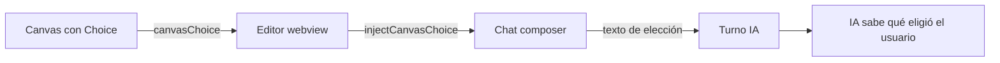

# Canvas HTML/CSS con wireframes y selección hacia el chat

## Contexto y decisiones

### Estado encontrado

El Canvas actual (`openideCanvasHtml.ts`) es un runtime JSX-lite que renderiza componentes React-like (`Stack`, `Card`, `Table`, `BarChart`, etc.) con CSS inline basado en variables `--vscode-*`. Los problemas concretos:

1. **Look TUI neón/morado**: `accent.primary` = `--vscode-textLink-foreground` (morado/azul en muchos temas), borders finos en todas partes, sin jerarquía visual → se ve como una TUI, no como HTML/CSS real.
2. **No hay wireframes**: los componentes son datos estructurados (tablas, charts, stats), no representaciones visuales de UI/estructura.
3. **Sin selección → chat**: `useCanvasAction` sólo despacha `openFile`/`openLink`/`newComposerChat`. No hay un mecanismo donde el usuario elija una opción en el canvas y esa elección llegue al chat como contexto del turno.
4. **La skill** instruye a la IA a generar canvases de "análisis cuantitativo, billing, auditorías" — no de wireframes/UI.

### Decisión 1: rediseño visual HTML/CSS wireframe

Mantener el runtime TSX (es seguro, sandboxed, sin red) pero cambiar radicalmente el CSS para que se vea como HTML/CSS moderno estilo Claude:

- **Paleta neutra**: reemplazar `accent.primary` morado por grises neutros (`--vscode-descriptionForeground`, `--vscode-disabledForeground`) con un único acento sutil (`--vscode-focusBorder` para interactivos).
- **Wireframe mode**: agregar primitivas `Wireframe`, `WireframeBox`, `WireframeLine`, `WireframeText` que renderizan bloques grises con placeholder text, como los wireframes de Claude (cajas grises con labels cortos).
- **Tipografía nativa**: usar `--vscode-font-family` con jerarquía clara (H1 24px → H3 16px → Text 14px → small 12px).
- **Spacing generoso**: padding 20-28px, gap 16px, border-radius 8-12px.
- **Sin neón**: quitar todos los `accent.primary` de bordes/strokes de datos; usarlos sólo en botones interactivos y links.

### Decisión 2: selección desde canvas → chat

Nuevo primitiva `Choice` + acción `canvasChoice`:

```tsx
const [selected, setSelected] = useCanvasState('choice', '');
const choose = useCanvasAction();
// ...
<Choice
  id="approach-a"
  title="Enfoque A: microservicios"
  description="Separar en servicios independientes"
  selected={selected === 'approach-a'}
  onSelect={() => { setSelected('approach-a'); choose({ type: 'canvasChoice', choiceId: 'approach-a', label: 'Enfoque A: microservicios' }); }}
/>
```

El editor (`openideCanvasEditor.ts`) recibe el mensaje `canvasChoice`, lo reenvía al chat vía un comando nuevo `openide.agent.injectCanvasChoice` que inserta el texto de la elección en el composer y/o lo envía como turno.

### Decisión 3: skill actualizada

La skill `openide-canvas` se actualiza para:
- priorizar wireframes y representaciones visuales de estructura/UI;
- usar las nuevas primitivas wireframe;
- incluir el patrón `Choice` para selección;
- mantener compatibilidad con charts/tablas para análisis.



## Archivos a tocar

| Ruta | Cambio |
|---|---|
| `vscode/src/vs/workbench/contrib/openideAgent/browser/openideCanvasHtml.ts` | Rediseño completo del CSS: paleta neutra, wireframe mode, primitivas `Wireframe*` y `Choice`. Runtime sin neón. |
| `vscode/src/vs/workbench/contrib/openideAgent/browser/openideCanvasEditor.ts` | Manejar `canvasChoice` → reenviar al chat vía comando. |
| `vscode/src/vs/workbench/contrib/openideAgent/browser/openideChatView.ts` | Registrar handler `injectCanvasChoice` que inserta texto en el composer. |
| `vscode/src/vs/workbench/contrib/openideAgent/browser/openideAgentSkills.ts` | Actualizar skill `openide-canvas` con wireframes + Choice. |
| `.openide/skills/openide-canvas/SKILL.md` | Mismo contenido de skill. |
| `vscode/src/vs/workbench/contrib/openideAgent/test/common/openideAgentCommon.test.ts` | Test de que el HTML del canvas tiene wireframe CSS y Choice. |

## Validación y revisión

1. `npm run compile-check-ts-native`.
2. `npm run compile`.
3. Tests common de OpenIDE Agent.
4. Tests browser existentes.
5. Verificar que el HTML generado tiene clases `.oc-wireframe`, `.oc-choice` y NO tiene `accent.primary` en strokes.
6. `review_changes` adversarial.
7. Build completo `dev/build.sh`.
8. Empaquetar y actualizar el AppImage instalado.

## Límites de commit

Un solo commit atómico: todo el rediseño del canvas + skill + bridge de selección. No separar CSS de bridge porque forman una unidad funcional.

## Riesgos y fuera de alcance

- No se rompe la compatibilidad con canvases existentes (charts/tablas siguen funcionando).
- No se agrega ejecución de JavaScript externa ni red.
- El wireframe es representación visual, no un editor WYSIWYG.
- La selección es una vía (canvas → chat), no bidireccional.

## Tareas

- [x] Rediseñar el CSS del canvas HTML: paleta neutra, sin neón morado, jerarquía tipográfica clara.
- [x] Agregar primitivas wireframe (`Wireframe`, `WireframeBox`, `WireframeLine`, `WireframeText`) al runtime.
- [x] Agregar primitiva `Choice` con soporte de selección visual y callback.
- [x] Agregar acción `canvasChoice` al runtime y exportarla en `useCanvasAction`.
- [x] Manejar `canvasChoice` en el editor → reenviar al chat.
- [x] Registrar comando `openide.agent.injectCanvasChoice` en el chat view.
- [x] Actualizar la skill `openide-canvas` con patrones wireframe y Choice.
- [x] Agregar tests de que el HTML tiene wireframe CSS, Choice y sin neón.
- [x] Ejecutar compile-check, tests y revisión adversarial.
- [x] Build completo de VSCode-linux-x64.
- [x] Empaquetar AppImage y actualizar el desktop instalado.
