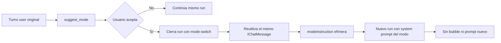

# Chat silencioso, exploración web y tools minimalistas

## Contexto y decisiones

### Estado encontrado

| Área | Implementación actual | Problema a resolver |
|---|---|---|
| Cambio de modo | `suggest_mode` queda interceptada en `openideAgentService.ts`; el webview acepta la card, `openideChatView.ts` espera el cierre del run y llama `resumeSilentlyInMode`. Ese método reutiliza el último `IChatMessage` user y, si llegó `prompt`, reemplaza `user.content` conservando `displayText`. | La reanudación ya evita un segundo bubble, pero la interpretación refinada se persiste como si fuera el contenido canónico del usuario. Hay que convertirla en contexto interno de ejecución y garantizar que nunca aparezca como prompt nuevo ni altere transcript/título/edición del mensaje. |
| Browser existente | `browser_open` y `OpenideBrowserAutomation` trabajan exclusivamente con la preview local visible y `normalizeLocalUrl`; esto es correcto para localhost y Pick & Polish. | No existe una tool headless/de red para buscar y leer la web pública. No debe ampliarse el browser local porque mezclaría preview visible, navegación externa y permisos. |
| Red disponible | `OpenideAgentService` ya dispone de `netRequests: IRequestService` mediante `OpenideRequestChannelClient`, por lo que las requests salen por el main process con cancelación y streaming IPC. | Falta una capa específica de exploración web con SSRF protection, redirect policy, límites de contenido, extracción textual y resultados citables. |
| Slash menu | `commandQuery` mezcla `listComposerCapabilities()` (tools, MCP y skills) con modos/comandos builtin y comandos de usuario. | Las tools y MCP no deben ser seleccionables manualmente con `/`; la IA ya recibe sus definiciones y debe decidir cuándo usarlas. Los comandos de workflow y, opcionalmente, skills explícitas sí pueden permanecer. |
| Tool UI | `addTool` crea `action-card`, badges `TOOL/MCP/SKILL`, iconos, argumentos, resultados y chevrons; edits, terminales, delegaciones, ask/todos y screenshots tienen componentes especializados. | Las tools genéricas deben verse como una línea simple estilo `Thinking`: texto con shimmer mientras corre y estado discreto al terminar, sin card/badge/argumentos visibles por defecto. Los componentes especializados deben conservar su UX funcional. |
| Build | `dev/build.sh` genera `VSCode-linux-x64`; `dev/build-appimage.sh` arma AppImage. En NixOS el empaquetado requiere `file` dentro del entorno de `appimagetool`. | Después de implementar hay que repetir compile/tests, product build, AppImage y smoke del artefacto. |

### Decisión 1: interpretación de modo como contexto interno, no como mensaje

La aceptación de `suggest_mode` mantendrá un único mensaje user persistido e idéntico en su contenido visible/canónico. El `prompt` refinado se renombrará conceptualmente a `modeInstruction` y viajará solamente en una opción efímera de `runMessages`/`runExistingTurn`, concatenada al contexto operativo del nuevo run. No se agregará otro `IChatMessage`, no se mutará `user.content`, no se cambiará `displayText` y no se renderizará un bubble.

Para `plan`, la instrucción interna indicará que el pedido original debe interpretarse y resolverse como plan revisable; el system prompt de modo plan seguirá siendo la autoridad. `fork` conservará su flujo separado porque crea deliberadamente otra conversación, pero tampoco deberá insertar automáticamente un prompt visible salvo una acción explícita posterior del usuario.

### Decisión 2: web pública separada del browser local

Se agregará un módulo `OpenideWebResearch` registrado en el `OpenideToolRegistry`, sin tocar la semántica localhost de `browser_*`.

Tools propuestas:

| Tool | Función | Salida |
|---|---|---|
| `web_search` | Consulta un proveedor configurable de búsqueda y devuelve resultados normalizados. | Lista numerada con título, URL canónica, snippet y cita estable `[S1]`, `[S2]`. |
| `web_fetch` | Descarga una URL HTTP(S), valida cada redirect y extrae contenido legible. | Título, URL final, metadata, texto acotado por secciones y cita `[W1]`. |

La primera versión tendrá un proveedor de búsqueda configurable y explícito. Se priorizará una API JSON estable; configuración propuesta: `openide.agent.web.enabled`, `openide.agent.web.searchEndpoint`, `openide.agent.web.searchApiKey` mediante secret storage cuando corresponda, `openide.agent.web.allowedHosts`, `openide.agent.web.blockedHosts`, `openide.agent.web.maxResponseBytes`, `openide.agent.web.maxExtractedChars` y `openide.agent.web.timeoutSeconds`. Si no hay proveedor configurado, `web_search` devolverá un error accionable y `web_fetch` seguirá disponible para URLs concretas.

Seguridad y privacidad:

- Sólo `https`; `http` opcional únicamente mediante setting explícito y nunca para direcciones privadas.
- Resolver DNS y rechazar loopback, link-local, RFC1918, CGNAT, multicast, IPv6 local/ULA y metadata cloud antes de cada request y redirect.
- Máximo de redirects, timeout total, bytes de headers/body, texto extraído y resultados.
- Rechazar credenciales embebidas, esquemas no HTTP(S), puertos no permitidos y downgrade HTTPS→HTTP.
- No enviar cookies, auth, proxy auth ni headers del browser; `User-Agent` propio y `Accept` restringido.
- Content types permitidos inicialmente: HTML, texto, JSON y Markdown. Binarios se rechazan.
- Extracción HTML sin scripts/styles/forms; normalización de whitespace; preservación de headings, links y bloques de código; nunca ejecutar JS.
- Registrar solamente host, status, bytes y duración; no guardar bodies ni API keys en logs/transcript.
- Approval `safe` para búsquedas/fetch públicos bajo policy endurecida; cualquier host agregado por allowlist seguirá pasando validación SSRF. Se puede configurar `ask` si el usuario prefiere confirmación por request.
- Cancelación ligada al token del run.

Citas:

- Cada resultado lleva ID determinista por invocación y URL canónica.
- `web_search` devuelve `[S1] Título — URL` y snippets.
- `web_fetch` devuelve `[W1] URL final` y agrega marcadores de fuente en el texto.
- El system prompt instruirá citar afirmaciones web como `[S1]`/`[W1]` y listar URLs al final; la tool no inventará citas si falla la descarga.

### Decisión 3: slash sólo para comandos explícitos

`commandQuery` dejará de incluir capacidades `tool` y `mcp`. La IA seguirá recibiendo todas las definiciones desde `OpenideToolRegistry.getDefinitions()` y podrá usarlas autónomamente. Se mantendrán:

- modos/workflows nativos (`/agent`, `/plan`, `/ask`, `/ultra`, `/compact`);
- comandos de usuario;
- skills sólo si se decide conservar su activación explícita. La implementación inicial conservará skills y ocultará tools/MCP, porque una skill representa contexto opt-in y no una llamada operacional.

Se eliminará compatibilidad visual para chips slash de `tool`/`mcp` nuevos. La lectura de sesiones históricas conservará los chips existentes para no romper transcripts persistidos, pero no podrán volver a seleccionarse desde el composer.

### Decisión 4: representación minimalista de tools

Las tools genéricas se mostrarán como `tool-activity`, una línea equivalente a `reasoning`:

- corriendo: `Leyendo archivo…`, `Buscando en la web…`, `Consultando código…` con clase `.shimmer`;
- completada: texto final breve sin shimmer y sin badge;
- error: texto breve con color/error icon discreto;
- detalle/resultados: ocultos por defecto; sólo se conservará un disclosure accesible cuando el resultado sea útil para diagnóstico, sin card ni bloque de argumentos visible.

No se degradarán componentes especializados:

- `edit_file`/`write_file`: mantienen diff y estadísticas;
- `run_command`: mantiene terminal embebida;
- `ask_user`: mantiene preguntas;
- `update_todos`: mantiene todos;
- `delegate_task`/`review_changes`: mantienen delegación;
- `browser_screenshot`: mantiene imagen;
- approvals y decisiones: mantienen UI necesaria.

`web_search` y `web_fetch` usarán la línea minimalista durante ejecución; el modelo recibe el contenido completo, mientras el transcript muestra como máximo un resumen (`Buscó “…” · N fuentes`, `Leyó example.com`). Las fuentes citadas quedarán en la respuesta final del asistente, no en una card de tool duplicada.

## Archivos a tocar

| Ruta | Cambio |
|---|---|
| `vscode/src/vs/workbench/contrib/openideAgent/browser/openideChatView.ts` | Cambiar `modeSuggestionResponse` y `resumeSilentlyInMode` para no mutar `user.content`; pasar una instrucción interna efímera al run. Filtrar `commandQuery` para excluir `tool` y `mcp`, manteniendo comandos y skills. |
| `vscode/src/vs/workbench/contrib/openideAgent/browser/openideAgentService.ts` | Extender opciones de `runMessages` con `modeInstruction`; inyectarla como contexto interno del run sin persistirla como mensaje. Registrar `web_search`/`web_fetch`, actualizar system prompt y descripciones, y exponer configuración/secretos necesarios. |
| `vscode/src/vs/workbench/contrib/openideAgent/common/openideAgentTypes.ts` | Definir el campo efímero de reanudación de modo y, si hace falta, tipos de resultados/citas web sin agregarlos al transcript persistido. |
| `vscode/src/vs/workbench/contrib/openideAgent/browser/openideWebResearch.ts` | Nuevo servicio/módulo: validación URL, DNS/IP policy, redirects, límites, search provider, fetch, extracción HTML/texto, normalización y citas. Usará `IRequestService` del main y `CancellationToken`. |
| `vscode/src/vs/workbench/contrib/openideAgent/browser/openideAgent.contribution.ts` | Registrar settings web, defaults seguros, enums/límites y descripciones. |
| `vscode/src/vs/workbench/contrib/preferences/browser/settingsLayout.ts` | Añadir settings web a la sección del agente sin mezclar con browser local. |
| `vscode/src/vs/workbench/contrib/openideAgent/browser/openideChatHtml.ts` | Quitar tools/MCP del flujo slash y chips nuevos; reemplazar card genérica de `addTool`/`finishTool` por actividad minimalista estilo Thinking; sumar labels para web; mantener componentes especializados y `prefers-reduced-motion`. |
| `vscode/src/vs/platform/request/common/openideRequestIpc.ts` | Sólo si hace falta exponer metadata/cancelación adicional para límites de redirects/body; preferir reutilizar el canal actual sin ampliar contrato. |
| `vscode/src/vs/workbench/contrib/openideAgent/test/common/openideAgentCommon.test.ts` | Tests sintácticos/estructurales del webview: no prompt duplicado, slash sin tool/MCP, markup minimalista y JS válido. |
| `vscode/src/vs/workbench/contrib/openideAgent/test/browser/openideChatModeTransition.test.ts` | Nuevo test de regresión: aceptar modo no agrega mensaje, no cambia display/content persistido, reanuda con modo e instrucción interna. |
| `vscode/src/vs/workbench/contrib/openideAgent/test/common/openideWebResearch.test.ts` | Tests puros de canonicalización URL, SSRF/IP ranges, redirects, límites, content types, extracción, citas y provider errors. |
| `vscode/src/vs/workbench/contrib/openideAgent/test/browser/openideChatToolPresentation.test.ts` | Test DOM/browser del shimmer, completion/error, disclosure accesible y preservación de edit/terminal/delegation. |
| `.github/workflows/ci-openide.yml` | Incluir tests de web research y browser UI dentro de los gates existentes. |
| `docs/reliability.md` | Documentar threat model de exploración web, límites, privacidad, citas y brechas conocidas. |
| `dev/build-appimage.sh` | Si el entorno NixOS sigue sin `file`, añadir preflight claro/override PATH reproducible; no descargar herramientas sin verificación adicional. |

## Validación y revisión

### Tests y diagnósticos

1. `npm run compile-check-ts-native`.
2. Compilar y ejecutar todos los tests common de OpenIDE Agent.
3. Ejecutar tests browser de transición, tool presentation, rollback, sesiones y change sets.
4. Tests de red con servidor HTTP local controlado, sin acceso real a Internet:
   - redirect público simulado;
   - redirect a IP privada bloqueado;
   - DNS rebinding simulado mediante resolver inyectable;
   - respuesta oversized/cancelada;
   - content-type binario;
   - HTML con scripts/forms;
   - citas deterministas;
   - API de búsqueda 401/429/5xx/JSON inválido.
5. `node dev/check-reliability-gates.mjs`, tests del registry y auditoría de branding.
6. `review_changes` adversarial en dos focos:
   - seguridad de red/SSRF/secretos/redirects/cancelación;
   - transcript/UI/regresión de modo/slash/accessibility.
7. Corregir todo `VERDICT: BLOCK` y repetir review.

### Criterios de aceptación

- Aceptar Plan/Agent/Ask/Ultracode no crea un segundo bubble ni un prompt visible, no cambia el texto original persistido y reanuda el mismo turno con el system prompt del modo.
- Restore/reload conserva un único mensaje user y no revela la interpretación interna.
- Escribir `/` no muestra ninguna tool builtin ni MCP; sí muestra workflows/comandos y skills explícitas definidas por la decisión anterior.
- La IA puede llamar tools normalmente aunque no aparezcan en slash.
- Tool calls genéricas usan una línea simple con shimmer; no muestran badge `TOOL`, argumentos ni card. Al terminar, el shimmer se detiene.
- Edits, terminales, approvals, todos, delegaciones y screenshots conservan su funcionalidad.
- `web_search` produce resultados citables y `web_fetch` extrae contenido sin abrir la preview local.
- Ninguna request web alcanza localhost, LAN, link-local, metadata cloud o un destino privado vía redirect/DNS.
- API keys no aparecen en logs, eventos, tool output ni transcript.
- Requests respetan cancelación, timeout, redirects y límites de bytes/chars.
- Browser local continúa rechazando web pública y no cambia su comportamiento.

### Build y smoke del artefacto

Después de aprobación e implementación:

1. Ejecutar validación completa y branding audit.
2. `bash dev/build.sh` hasta producir `VSCode-linux-x64` fresco; guardar log completo y distinguir timeout del runner de fallo real.
3. Verificar marcadores del código nuevo en `resources/app/out` y ejecutar `openide --version`/CLI smoke.
4. Empaquetar con `dev/build-appimage.sh`; en NixOS incluir `file` en `PATH`/FHS de forma explícita y reproducible.
5. Ejecutar AppImage con `APPIMAGE_EXTRACT_AND_RUN=1 --version`, inspeccionar `product.json`, iconos, desktop entry, permisos y ausencia de branding heredado.
6. Calcular SHA-256 y reportar ruta/tamaño/hash. No instalar ni reemplazar la versión actual sin una orden separada.

## Límites de commit

### Commit 1 — transición de modo y slash

Debe incluir conjuntamente:

- contrato efímero de `modeInstruction`;
- reanudación sin mutar transcript;
- filtro de tools/MCP en slash;
- tests de transición y menú.

No mezclar todavía la nueva red para que cualquier regresión de transcript pueda revertirse aisladamente.

### Commit 2 — exploración web segura

Debe incluir conjuntamente:

- `openideWebResearch.ts`;
- registro de tools;
- settings;
- threat model y tests SSRF/redirects/limits/citas.

La validación URL y la ejecución de requests no deben separarse en commits distintos: forman una frontera de seguridad atómica.

### Commit 3 — presentación minimalista

Debe incluir:

- CSS/DOM `tool-activity`;
- adaptación `addTool`/`finishTool`;
- preservación explícita de componentes especializados;
- tests browser y accessibility.

### Commit 4 — build/release tooling

Sólo si hay que cambiar `dev/build-appimage.sh` o CI por el requisito `file`/FHS. No mezclar artefactos binarios generados con source code salvo política explícita del repo.

Antes de cada commit: `git_status`, review del diff acotado, `git_preflight` con paths explícitos y aprobación del usuario. No incluir los demás cambios preexistentes del workspace.

## Riesgos y fuera de alcance

- No se implementará un navegador web invisible con ejecución de JavaScript. `web_fetch` será HTTP + extracción estática; sitios client-rendered podrán devolver poco contenido.
- No se hará crawling autónomo ilimitado. Cada llamada tendrá resultados, profundidad, redirects y tamaño acotados.
- No se almacenará un índice web ni historial persistente de navegación.
- No se enviarán cookies/sesiones del browser nativo a la tool web.
- No se reutilizará la allowlist de `browserAllowedHosts`: preview local y web research tienen threat models opuestos.
- No se introducirán credenciales de un proveedor de búsqueda en archivos del repo; se usarán settings/secret storage.
- La primera versión no promete bypass de paywalls, CAPTCHAs, robots ni autenticación web.
- Los transcripts históricos con cards/chips antiguos seguirán siendo legibles; no se hará migración destructiva.
- La AppImage será una build local de prueba, no una release firmada/publicada.

## Tareas

- [x] Introducir `modeInstruction` efímera y cambiar la reanudación para preservar intacto el único mensaje user.
- [x] Agregar tests de aceptación/rechazo/restauración del cambio de modo sin prompt visible nuevo.
- [x] Filtrar capacidades `tool` y `mcp` de `commandQuery`, manteniendo workflows, comandos y skills explícitas.
- [x] Agregar tests del menú slash y compatibilidad de transcripts históricos.
- [x] Crear `openideWebResearch.ts` con tipos, URL canonicalization, política SSRF/DNS, redirects y límites.
- [x] Implementar `web_search` con provider configurable, normalización de resultados y citas `[S#]`.
- [x] Implementar `web_fetch` con extracción HTML/texto segura, URL final y citas `[W#]`.
- [x] Registrar settings web, secret handling y documentación del threat model.
- [x] Agregar tests de red controlados para redirects, IPs privadas, rebinding, cancellation, oversized, content types y errores de provider.
- [x] Reemplazar la card genérica de tools por una línea minimalista estilo Thinking con shimmer y estado accesible.
- [x] Preservar y probar componentes especializados de edición, terminal, approvals, todos, delegaciones y screenshots.
- [x] Ejecutar compile-check, tests common/browser, reliability/branding y revisión adversarial hasta no tener `BLOCK`.
- [x] Construir `VSCode-linux-x64`, verificar que el bundle contiene los cambios y ejecutar smoke CLI.
- [x] Empaquetar AppImage con entorno FHS/PATH reproducible, ejecutar smoke del artefacto y calcular SHA-256.
- [x] Reportar ruta, tamaño, hash y pasos de prueba sin instalar ni reemplazar automáticamente la versión existente.
