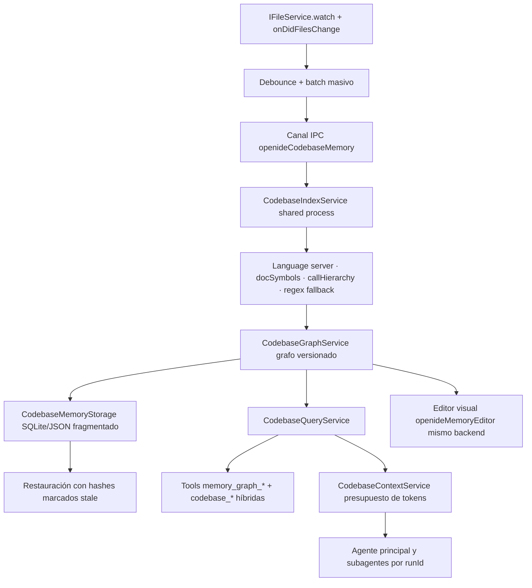

# Memoria real e integrada del codebase + pestañas de subagentes transitorias

## Contexto y decisiones

### Arquitectura actual encontrada

OpenIDE hoy tiene **tres subsistemas** que se solen llamar "memoria":

| Subsistema | Implementación | Fuente de datos | Consume el agente | Editor visual |
|---|---|---|---|---|
| Memoria agéntica persistente | `OpenideAgentMemory` (browser) | `.openide/MEMORY.md` + `USER.md` | ✅ Sí, en el system prompt | No (sólo Markdown) |
| Grafo heurístico "galaxia" | `OpenideMemoryService` + `openideMemoryIndexer` (regex) + `openideMemoryLayout` | Workspace completo (regex por lenguaje) | ❌ No | ✅ `openideMemoryEditor` (WebGL) |
| Grafo AST vía language server | `OpenideCodebaseGraph` (browser) | `getWorkspaceSymbols`, `OutlineModel`, `CallHierarchyModel` | ✅ Sí, mediante `codebase_search`/`codebase_explore`/`codebase_callers` | No |

### Causa exacta de la desconexión

- `OpenideMemoryService` **no es consumido por `OpenideAgentService`** ni por `OpenideToolRegistry`. Sus métodos `searchGraph`/`exploreNode`/`findCallers` son invocados únicamente desde el editor visual y exponen POJOs `IMemoryNode`/`IMemoryEdge` distintos de los `SymbolHit`/`SymbolDetailHit` que devuelven las tools `codebase_*`.
- Las tools del agente (`codebase_search`, `codebase_explore`, `codebase_callers`) llaman directamente a `OpenideCodebaseGraph`, que **consulta en vivo al language server** sin caché, sin persistencia y sin grafo agregado. Cada llamada repite consultas costosas y no deja huella.
- El indexer regex se ejecuta **sincrónicamente en el renderer** dentro de `build()`: hace un `walk()` recursivo, lee cada archivo y parsea con regex. No hay chunking ni yielding; en repos grandes puede trabar la UI. Tampoco hay persistencia: todo se reconstruye desde cero.
- No existe incremental: `rebuild()` cancela el CTS anterior y arranca de nuevo. Cualquier edición de archivo dispara un rebuild completo si el editor está abierto.
- El grafo se guarda sólo en memoria (`_graph`, `_layout`). Al recargar la ventana o cerrar/reabrir el workspace se pierde todo y hay que reindexar desde cero.

### Pestañas de subagentes que se acumulan

`OpenideChatSessions.createBackground()` (línea ~288) hace `this.openTabIds.push(id)` al crear una sesión de subagente. Por eso cada subagente aparece como tab persistente en el strip y nunca se cierra, aunque el run ya terminó. El método lo usa `OpenideChatViewPane.trackSubagentEvent()` ante cada `subagentStart`. La sesión queda como `forked: true` pero sigue siendo una tab más.

### Infraestructura reutilizable

- **`OpenideCodebaseGraph`**: la base correcta. Ya envuelve `getWorkspaceSymbols`, `OutlineModel.create` (document symbols), `CallHierarchyModel.create` (callers/callees) con timeout (`raceTimeout`) y fallback degradado. Reutilizar su lógica como provider de máxima confianza y como verificador de relaciones.
- **Language server APIs nativas**: `getWorkspaceSymbols` (índice del language server), `ILanguageFeaturesService.documentSymbolProvider`, `CallHierarchyModel`, `ITypeHierarchyParticipant`/`TypeHierarchyDirection`, `provideReferences` (referencias), `provideDefinition`, `provideImplementation`. Son multi-lenguaje y ya corren en el extension host.
- **`IFileService`**: `watch(uri, { recursive, excludes })` + `onDidFilesChange(e)` + `e.affects(uri)`. Patrón ya usado por `OpenideAgentCommands`, `OpenideSubagentRegistryService`, `extensionsWatcher`, `workspaceWatcher.ts`.
- **`ISharedProcessService`**: canal IPC hacia el **shared process** (proceso node separado, ya levantado por `desktop.main.ts`). Es la ubicación correcta para indexación pesada fuera del renderer, igual que `mcpManagement`, `userDataSync`, `extensionManagement`. Permite `registerChannel`/`getChannel` con `ProxyChannel`.
- **Editor web worker** (`createWebWorker` de Monaco): alternativa liviana para parseo sintáctico off-renderer, pero sin acceso al language server ni a `IFileService`; útil sólo para layout/regex fallback.
- **`OpenideOverlayWebviewEditor`**: base del editor visual; ya la usan plan/canvas/memory/proveedores.
- **`OpenideAgentMemory`**: patrón a imitar para IDs estables (`workspace/uri#símbolo:linea`) y snapshots congelados.
- **`IMemoryGraph`/`IMemoryNode`/`IMemoryEdge`**: modelo de datos inicial, pero limitado (sin `kind` extendido, sin `confidence`, sin `evidence`, sin `qualifiedName`, sin `signature`). Hay que extenderlo en archivos nuevos sin romper el formato actual del editor.

### Decisiones principales

1. **Híbrido, no reemplazo.** El language server sigue siendo la fuente de máxima confianza. El grafo actúa como caché, índice agregado, fallback para lenguajes sin LS y punto de entrada para análisis de impacto/recuperación de contexto.
2. **Un único grafo canónico**, versionado, persistido por workspace, compartido entre agente, subagentes y editor visual. Nadie mantiene su propia copia.
3. **Indexación fuera del renderer** vía shared process + canal IPC. El renderer sólo solicita, escucha progreso y consulta.
4. **Incremental con debounce** sobre `IFileService.watch`: por hash por archivo, reindexación selectiva de nodos/aristas dependientes, coalescing de ráfagas y lote masivo para checkouts grandes.
5. **Providers en cascada** con `evidence` (`provider` + `confidence` + `verified` + `indexedAt`). Orden: language server → document symbols → call/type hierarchy → references → regex fallback → texto. Las aristas regex nunca se presentan como verificadas.
6. **IDs determinísticos** derivados de `workspace + uri + kind + qualifiedName + (línea|firma)`, nunca sólo el nombre. Permite renombrado de archivo preservando relaciones cuando el contenido no cambió.
7. **Tools nuevas `memory_graph_*`** que exponen el grafo de forma transparente y marcan frescura/confianza. Integración híbrida: `codebase_explore` consulta primero el grafo (rápido) y verifica relaciones críticas con language server antes de responder.
8. **Recuperación automática de contexto** con presupuesto de tokens configurable; se inyecta como bloque estructurado compacto, no como grafo entero.
9. **Aislamiento por `runId`** para subagentes: grafo global inmutable para consumers; cada run mantiene sus propias consultas, tokens y resultados.
10. **Reindexación tras cambios del agente y rollback**: el watcher detecta la escritura, invalida nodos del archivo y reindexa; el rollback dispara el mismo flujo sobre los archivos revertidos.
11. **Falla segura**: si la memoria falla o está deshabilitada, las tools `codebase_*` actuales siguen funcionando exactamente como hoy (consultan el LS en vivo).
12. **Subagentes transitorios en el strip**: `createBackground` debe abrir tab sólo mientras el run esté activo; al terminar, cierra la tab y deja la sesión en el panel de Agentes.
13. **Migración gradual** de `OpenideMemoryService`: no borrarlo en la etapa 1; el editor visual se reconecta al backend nuevo manteniendo el formato de layout actual.

### Flujo objetivo

## Archivos a tocar

### Existentes

| Ruta | Cambio previsto |
|---|---|
| `vscode/src/vs/workbench/contrib/openideAgent/common/memory/openideMemoryTypes.ts` | Extender modelo: `kind` amplio, `evidence`, `qualifiedName`, `signature`, `hash`, `confidence`, `verified`, `indexVersion`, sin romper el formato viejo del layout |
| `vscode/src/vs/workbench/contrib/openideAgent/browser/openideMemoryService.ts` | Reconectar a `ICodebaseMemoryService`; métodos sólo delegan al backend real; mantiene `getLayout` para el editor |
| `vscode/src/vs/workbench/contrib/openideAgent/browser/openideMemoryEditor.ts` | Consumir snapshots/versionado del nuevo backend; agregar filtros por tipo/relación/confianza y acciones |
| `vscode/src/vs/workbench/contrib/openideAgent/browser/openideAgentService.ts` | Registrar tools `memory_graph_*`; híbrido en `codebase_*`; recuperación automática de contexto; reindexación tras escritura/rollback |
| `vscode/src/vs/workbench/contrib/openideAgent/browser/openideCodebaseGraph.ts` | Exponer primitivas LS reutilizables para providers del indexer (sigue siendo el verificador) |
| `vscode/src/vs/workbench/contrib/openideAgent/browser/openideAgent.contribution.ts` | Registrar nuevos servicios, comandos y configuración de memoria |
| `vscode/src/vs/workbench/contrib/openideAgent/browser/openideChatSessions.ts` | `createBackground` transitorio: tab abierta sólo mientras el run corre |
| `vscode/src/vs/workbench/contrib/openideAgent/browser/openideChatView.ts` | Cerrar tab del subagente en `subagentDone`; alimentar el árbol desde el panel |
| `vscode/src/vs/workbench/contrib/preferences/browser/settingsLayout.ts` | Sección `openideAgent/memory` |
| `.github/workflows/ci-openide.yml` | Nuevas suites common/browser/shared-process |

### Nuevos

| Ruta propuesta | Responsabilidad |
|---|---|
| `common/memory/openideCodebaseMemoryTypes.ts` | Contratos puros: `ICodebaseMemoryNode`, `ICodebaseMemoryEdge`, `Evidence`, `QueryResult`, `IndexVersion`, guards y normalización |
| `common/memory/openideCodebaseMemoryProviders.ts` | Jerarquía de providers con evidencia/confianza |
| `node/openideCodebaseMemoryIndexer.ts` | Coordinador en shared process: lotes, prioridad, cancelación, CPU budget |
| `node/openideCodebaseMemoryStorage.ts` | Persistencia por workspace con hashes, migraciones y restauración stale |
| `node/openideCodebaseMemoryWorker.ts` | (Opcional) worker interno del shared process para parseo paralelo |
| `browser/openideCodebaseMemoryService.ts` | Fachada renderer: canal IPC, caché, eventos de progreso |
| `browser/openideCodebaseGraphService.ts` | Grafo inmutable versionado en el renderer; snapshots y traversal |
| `browser/openideCodebaseQueryService.ts` | Búsqueda híbrida con ranking, explore, callers/callees, paths, impacto |
| `browser/openideCodebaseContextService.ts` | Selección de contexto con presupuesto de tokens y aislamiento por runId |
| `browser/openideCodebaseMemory.contribution.ts` | Servicios, canal, comandos y settings de memoria |
| `test/common/openideCodebaseMemoryTypes.test.ts` | Guards, normalización y migraciones puras |
| `test/node/openideCodebaseMemoryIndexer.test.ts` | Indexación, incremental, debounce, cancelación |
| `test/node/openideCodebaseMemoryStorage.test.ts` | Persistencia, restauración stale, índice corrupto |
| `test/browser/openideCodebaseQueryService.test.ts` | Búsqueda híbrida, callers, impacto, rutas |
| `test/browser/openideCodebaseContextService.test.ts` | Presupuesto de tokens y aislamiento por runId |
| `test/browser/openideCodebaseEditorIntegration.test.ts` | Editor consumiendo el mismo backend |
| `test/browser/openideSubagentTabs.test.ts` | Pestañas transitorias |

## Riesgos y fuera de alcance

### Riesgos

1. **Latencia del canal IPC.** Toda consulta cruza shared process; mitigado con caché en renderer y respuestas degradadas por timeout.
2. **Language server frío.** Las APIs nativas son lentas en indexación inicial; cada provider debe tener timeout y degradar a regex.
3. **Persistencia corrupta.** Migración de esquema + validación por workspace + fail-safe: si el índice está roto, se reconstruye en background sin bloquear.
4. **Explosión de aristas.** Limites (`maxEdges`, `maxSymbolsPerFile`) y deduplicación por par `(source, type, target)`.
5. **Workspace masivo.** Indexación por lotes con yielding y CPU budget; no bloquear el renderer.
6. **Remote/WSL/SSH/Dev container.** Las APIs nativas igual funcionan, pero la persistencia debe ser local al workspace; respetar `IWorkspaceContextService` y esquemas no-`file:`.
7. **Cambios de rama masivos.** Debounce largo + operación masiva + marcar todo como stale y validar hashes progresivamente.
8. **`OpenideMemoryService` legacy.** Mantiene la interfaz mientras el editor migra; al final se elimina en una etapa posterior, no en la inicial.
9. **Tabs transitorias de subagentes.** Si el usuario activa una tab de subagente manualmente, debe respetarse su elección (no cerrar tabs abiertas explícitamente por el usuario).

### Fuera de alcance inicial

- Embeddings vectoriales (queda declarado pero no requerido para v1).
- Soporte completo de tree-sitter embebido (se aprovecha cuando el extension host lo provee; no se bundlea).
- Búsqueda semántica por similitud.
- Memoria distribuida entre m��quinas.
- Integración con memoria agéntica `MEMORY.md` (son sistemas distintos; se pueden vincular después).

## Validación y revisión

### Estrategia de pruebas (42 escenarios)

1–9: construcción inicial, restauración, archivo sin cambios, archivo modificado, archivo eliminado, renombrado conservando relaciones, evento masivo agrupado, cancelación, LS como provider principal.
10–18: regex como fallback, relaciones con confianza, stale, verificación con LS, búsqueda exacta, parcial, qualified name, exploración, callers/callees.
19–27: referencias, herencia, implementaciones, tests relacionados, impacto, rutas, integración con tool del agente, recuperación automática de contexto, presupuesto de tokens.
28–36: subagente, dos subagentes en paralelo, no mezcla por runId, reindexación tras cambio del agente, tras rollback, persistencia tras reinicio, multi-root, archivo excluido, workspace no confiable.
37–42: índice corrupto, migración de esquema, editor consumiendo el mismo backend, renderer no ejecuta indexación pesada, agente sigue funcionando sin memoria, pestañas transitorias de subagentes.

### Validaciones técnicas

- `get_diagnostics` en todos los archivos modificados.
- `npm run compile-check-ts-native` tras cada etapa.
- `npm run compile` (gulp) al cerrar indexación + persistencia.
- Tests common Mocha (tipos/providers/migraciones puras).
- Tests browser Chromium (query/context/editor/integración).
- Tests node/shared-process (indexer/storage/incremental).
- `valid-layers-check` con memoria suficiente; respetar la separación browser/node/electron-main.
- Revisión adversarial por etapa: foco en aislamiento por `runId`, frescura/confianza, no bloqueo del renderer, idempotencia de reindexación, fail-safe si la memoria falla.

## Límites de commit

1. **Subagentes transitorios + tipos comunes.** Aislado, rápido y reversible.
2. **Backend shared process (indexer + storage + providers).** Sin tocar el agente todavía.
3. **Servicios renderer (graph + query + context) + canal IPC.** Conecta con el backend.
4. **Tools `memory_graph_*` + híbrido en `codebase_*`.** Expone al agente.
5. **Recuperación automática de contexto + subagentes + reindexación tras cambios/rollback.**
6. **Editor visual reconectado + comandos/settings.**
7. **Migración de `OpenideMemoryService` legacy + tests finales + CI.**

No mezclar refactors generales del agente ni cambios de branding en estos commits.

## Tareas

- [x] Hacer que `OpenideChatSessions.createBackground` abra la tab del subagente sólo mientras el run está activo y la cierre al terminar, conservando la sesión en el panel de Agentes.
- [x] Cerrar la tab en `OpenideChatViewPane` cuando llega `subagentDone`/`subagentRun` terminal, respetando tabs abiertas manualmente por el usuario.
- [x] Agregar tipos comunes puros: `ICodebaseMemoryNode` extendido, `ICodebaseMemoryEdge`, `Evidence`, `QueryResult`, `IndexVersion`, guards y normalización, sin romper `IMemoryLayout` actual.
- [x] Implementar providers jerárquicos con evidencia/confianza: language server, document symbols, call/type hierarchy, references, regex fallback, texto.
- [x] Implementar `ICodebaseIndexService` en el shared process: lotes, prioridad de archivos abiertos/recientes, cancelación, CPU budget, yielding.
- [x] Implementar `ICodebaseMemoryStorageService`: persistencia por workspace con hashes, migraciones de esquema, restauración marcando stale, compactación y estadísticas.
- [x] Exponer el canal IPC `openideCodebaseMemory` en shared process y registrar la fachada renderer (`ICodebaseMemoryService`) con caché y eventos de progreso.
- [x] Implementar `ICodebaseGraphService` en el renderer: grafo inmutable versionado, snapshots, traversal y actualizaciones parciales desde el backend.
- [x] Implementar `ICodebaseQueryService`: búsqueda híbrida con ranking (exacto/prefijo/substring/path/centralidad/frescura), explore, callers/callees transitive, referencias, herencia, implementaciones, tests relacionados, rutas y análisis de impacto.
- [x] Implementar `ICodebaseContextService`: selección automática de contexto con presupuesto de tokens, deduplicación, orden por relevancia y aislamiento por `runId`.
- [x] Agregar incremental con debounce sobre `IFileService.watch`: hash por archivo, reindexación selectiva, lote masivo para cambios grandes, reindexación tras cambios/rollback del agente y cambio de rama.
- [x] Exponer tools `memory_graph_status`, `memory_graph_search`, `memory_graph_explore`, `memory_graph_callers`, `memory_graph_callees`, `memory_graph_impact`, `memory_graph_path`, `memory_graph_related_tests` con evidencia y frescura.
- [x] Integrar de forma híbrida `codebase_explore`/`codebase_callers`/`codebase_search`: memoria como acelerador y language server como verificador de relaciones críticas.
- [x] Inyectar contexto automático antes de tareas sensibles (modificaciones de funciones/tipos/endpoints/autenticación) dentro del presupuesto configurado.
- [x] Permitir que subagentes consulten el grafo global inmutable con consultas, métricas y tokens propios sin mezclar eventos entre `runId`.
- [x] Reconectar `openideMemoryEditor` al mismo backend; agregar filtros por tipo/lenguaje/relación/confianza y acciones (abrir definición, callers/callees, impacto, agregar al contexto, analizar impacto).
- [x] Agregar comandos: Open/Build/Update/Clear Codebase Memory, Show Status, Analyze Symbol Impact, Add Memory Context to Chat, Reindex Current/Modified Files.
- [x] Agregar settings `openide.memory.*` con defaults seguros (enabled, indexOnOpen, incrementalIndexing, persistIndex, límites, useLanguageServers, useTreeSitter, enableRegexFallback, showHeuristicRelations, indexTests, indexDependencies, presupuesto de tokens, exclude/include).
- [x] Garantizar privacidad/seguridad: respetar `.gitignore`, excludes del workspace, límites de tamaño, workspace trust y no indexar secretos; nunca enviar el índice completo al modelo.
- [x] Mantener métricas locales: archivos indexados/omitidos, tiempos, nodos/relaciones verificadas vs heurísticas, consultas, latencia, tokens ahorrados, actualizaciones incrementales.
- [x] Manejar errores: índice corrupto, migración, cambio de workspace/ruta, LS no disponible, parser ausente, archivos enormes, encoding, cancelación, cierre de ventana, Git checkout masivo, eventos duplicados/fuera de orden, multi-root, archivos virtuales/notebooks, remote/WSL/SSH/dev container.
- [x] Migrar `OpenideMemoryService` legacy gradualmente: mantener compatibilidad del editor y del comando `openide.memory.open` hasta que el backend nuevo esté validado; eliminar al cierre.
- [x] Ejecutar typecheck, compile, tests common/browser/node, lint y valid-layers; corregir errores propios y documentar bloqueos preexistentes.
- [x] Ejecutar revisión adversarial por etapa y final sobre aislamiento por runId, frescura/confianza, no bloqueo del renderer, idempotencia de reindexación y fail-safe; preparar commits atómicos sin cambios ajenos.
