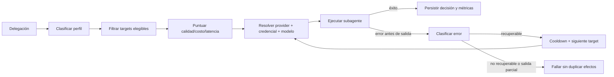
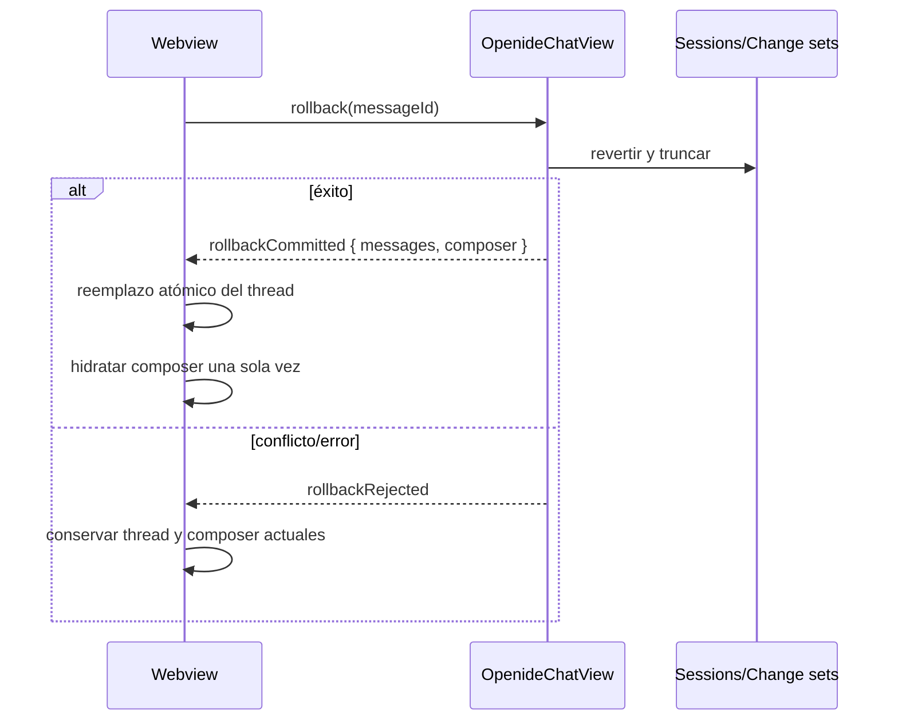

# Motor opcional de routing inteligente para subagentes, Antigravity y rollback del chat

## Contexto y decisiones

### Estado real encontrado

OpenIDE ya tiene piezas importantes, pero hoy están desacopladas:

| Área | Estado actual | Brecha concreta |
|---|---|---|
| Subagentes persistentes | `SubagentOrchestrationService` crea runs persistentes, aplica profundidad/permisos y delega en `executeRegisteredSubagent()` | El run fija solamente un `model` textual; no conserva provider elegido, intentos, motivo de selección ni fallbacks |
| Resolución del runtime | `resolveSubagentContext()` usa siempre el provider activo del chat y trata el override como nombre de modelo dentro de ese mismo provider | Una definición no puede seleccionar de forma segura `provider/model`; un modelo de otro provider puede enviarse al provider activo |
| Subagentes legacy | `delegate_task` y `review_changes` reutilizan el `subCtx` del agente padre | Tampoco pasan por una política de routing; deben converger en el mismo motor para que el comportamiento sea consistente |
| Failover del agente raíz | `runMessagesInternal()` ya usa `classifyProviderError()`, retry y `fallbackChain` | La lógica está incrustada en el loop raíz y no es reutilizable por subagentes |
| Errores | Se distinguen auth, billing, rate-limit, transient/network y fatal | Un 404 de modelo/proyecto retirado cae hoy como `fatal` genérico, por lo que no activa fallback |
| Catálogo de modelos | `OpenideModelCatalog` conoce contexto, salida, visión y razonamiento; providers exponen listas estáticas o `/models` en pocos casos | No hay precio, calidad por tarea, estado de salud ni disponibilidad validada por cuenta |
| Settings > Subagentes | Ya existe la categoría `openideAgent/subagents` con settings genéricos | No existe un módulo visual para definir perfiles, prioridades y ver salud/intentos |
| Persistencia | Configuración en `IConfigurationService`; runs en `openide.subagents.runs.v1` | Falta versionar la política de routing y persistir la decisión/auditoría de cada run |
| Rollback | `rollbackToUserMessage()` trunca correctamente después de revertir el change set y llama `postRestore()` | El botón del webview copia el texto al composer **antes** de confirmación y conserva el turno visible hasta que llega otro mensaje; además host y webview actualizan transcript/composer por mensajes separados, permitiendo estados duplicados |

### Diseño elegido: routing determinista por perfiles, no selección opaca por LLM

El motor será **opcional** y se activará sólo con `openide.subagents.routing.enabled`. Desactivado, se conserva exactamente el comportamiento actual. Activado, cada ejecución se clasifica en un perfil de tarea y se puntúan targets explícitos `providerId + model` conectados.

Perfiles iniciales:

- `planning`: diseño, arquitectura, contratos y razonamiento complejo.
- `implementation`: escritura/refactor y uso intensivo de tools.
- `review`: revisión adversarial y detección de regresiones.
- `simple-fix`: correcciones acotadas e instrucciones simples.
- `research`: exploración read-only del codebase.
- `general`: fallback semántico cuando no hay señal suficiente.

La clasificación será determinista y auditable usando, en orden:

1. perfil explícito de la definición del subagente;
2. origen conocido (`review_changes` → `review`, subagente writable → `implementation`);
3. permisos/tools y readonly de la definición;
4. heurísticas acotadas sobre la tarea;
5. `general`.

No se llamará a otro modelo sólo para elegir modelo: agregaría costo, latencia y un nuevo punto de fallo. La UI permitirá ordenar candidatos por perfil y ajustar pesos `quality`, `cost` y `latency`. Cuando falten datos de precio/calidad, se usará el orden manual como fuente autoritativa y no se inventarán valores.

### Contrato de targets y score

Cada candidato será un target inequívoco:

```ts
{ providerId: string; model: string; enabled: boolean; quality?: number; cost?: number; latency?: number }
```

Reglas de elegibilidad antes de puntuar:

- provider existente y conectado;
- credencial resoluble, sin exponerla ni persistirla;
- modelo presente en la lista conocida del provider o marcado manualmente para provider custom;
- capacidades requeridas por la tarea: tools, visión, reasoning, contexto mínimo y escritura;
- target no bloqueado por cooldown/estado de salud;
- target no repetido dentro del mismo run.

Score normalizado: `qualityWeight * quality - costWeight * cost - latencyWeight * latency`, con el orden manual como desempate estable. Los pesos serán por perfil; el preset predeterminado será “balanceado”. La primera versión no prometerá optimización monetaria exacta si el provider no publica precios.



### Política de retry, fallback y seguridad

Separar dos niveles:

1. **Retry del mismo target**: sólo transient, overload y rate-limit corto, respetando `retryAfterMs` y los límites actuales.
2. **Fallback a otro target**: auth inválida/revocada, billing/payment/quota, rate-limit agotado, modelo/endpoint inexistente o retirado, provider no disponible y network/overload tras agotar retry.

Restricciones:

- fallback sólo antes de emitir texto/tool call o producir side effects;
- para subagentes escritores, no cambiar de target después de la primera tool mutante;
- una renovación OAuth automática por provider antes de descartarlo;
- cooldown en memoria con expiración distinta por clase: rate limit según `Retry-After`, auth/billing hasta reconexión o cambio de configuración, retired/not-found con TTL largo;
- un fallo de un modelo bloquea `provider/model`, no necesariamente todo el provider;
- límite de intentos configurable y deduplicación por clave `providerId\0model`.

### Clasificación de errores ampliada

Extender el clasificador para distinguir:

- `model-not-found` / `model-retired`: 404/NOT_FOUND con referencias a model, endpoint o entidad solicitada;
- `project-not-found`: proyecto Code Assist inexistente/no autorizado;
- `provider-unavailable`: provider retirado o endpoint discontinuado;
- mantener `authentication`, `billing`, `rate-limit`, `overloaded`, `network`, `format`, `context-overflow` y `multimodal-unsupported`.

El clasificador deberá aceptar metadata estructurada (`status`, provider, model, endpoint y body) además del string legacy. Esto evita interpretar cualquier HTTP 404 como modelo retirado.

### Diagnóstico de Antigravity

El 404 observado se puede explicar desde el código actual:

1. `openideProviderCatalog.ts` publica una lista **completamente estática** para Antigravity y usa por defecto `gemini-3.5-flash-low`.
2. Esos IDs se mandan sin validación a `v1internal:streamGenerateContent` en el campo `body.model`.
3. Antigravity no tiene discovery dinámico de modelos ni validación por cuenta/suscripción; `resolveProviderModels()` devuelve siempre esa lista estática.
4. Google responde `HTTP 404 ... Requested entity was not found` cuando el alias no existe, fue retirado o no está disponible para la cuenta/proyecto.
5. `classifyProviderError()` no reconoce 404/NOT_FOUND, lo clasifica como fatal y no recorre `fallbackChain`.

Por lo tanto, la causa más probable en esta build es **un alias hardcodeado inválido/no habilitado**, especialmente el default `gemini-3.5-flash-low`. Hay una segunda posibilidad que debe distinguirse con diagnóstico estructurado: `ensureProject()` cachea un único `projectId` por instancia y el 404 puede referirse a un proyecto Code Assist obsoleto/no accesible. La corrección debe registrar etapa segura (`loadCodeAssist`, `onboardUser` o `streamGenerateContent`), provider/model y status — nunca bearer, API keys ni cuerpos sensibles — para confirmar cuál entidad falla.

Corrección propuesta para Antigravity:

- no depender de aliases especulativos como default;
- incorporar obtención/cache de modelos habilitados por la cuenta si el gateway ofrece endpoint/config de discovery; si no, mantener una lista conservadora validada y permitir un probe explícito desde Settings;
- invalidar `projectId` al cambiar cuenta, provider, override GCP o ante `project-not-found`, y ejecutar una sola re-resolución;
- clasificar `NOT_FOUND` del stream como `model-not-found` y probar el siguiente target/model antes de fallar;
- mostrar en Proveedores el modelo rechazado y una acción “Actualizar modelos / Probar conexión”.

No se debe ocultar el problema rotando silenciosamente para siempre: la UI conservará el historial de intentos y el motivo de descarte.

### Settings > Subagentes

Crear un módulo visual dedicado dentro de la categoría existente `openideAgent/subagents`, integrado al `OpenideSettingsEditor` como las páginas de Providers/Extensions. Contenido:

- toggle “Routing inteligente de modelos” — apagado por defecto para migración compatible;
- preset `Manual`, `Calidad`, `Balanceado`, `Ahorro`;
- perfiles de tarea con orden drag/drop de targets;
- selector sólo con providers conectados y sus modelos conocidos;
- pesos opcionales y restricciones de capacidades/contexto;
- máximo de intentos y fallback on/off;
- estado por target: disponible, cooldown, auth, billing, rate-limit, modelo no encontrado;
- botón de prueba que hace una verificación mínima cancelable y no crea un turno de chat;
- vista “Última decisión” por run con perfil, score, target inicial, fallbacks y motivo.

Persistencia:

- settings simples en `IConfigurationService` para enabled/preset/maxAttempts;
- política estructurada versionada en una única key `openide.subagents.routing.policy`, con schema JSON y validación estricta;
- salud/cooldowns en storage de aplicación, sin sincronizar secretos y con timestamps/TTL;
- snapshot de decisión e intentos dentro de `ISubagentRun`, migrado desde `runs.v1` a `runs.v2` de forma tolerante.

Las definiciones Markdown seguirán aceptando `model: default`. Se ampliarán de forma compatible con `profile:` y target explícito `provider/model`; un `model:` legacy sin provider conserva la semántica actual cuando routing está apagado y actúa como preferencia no obligatoria cuando está encendido.

### Observabilidad

Agregar timeline y métricas locales, sin telemetría externa ni secretos:

- `routingDecision`: perfil, candidatos elegibles/descartados y razón;
- `providerAttempt`: provider, model, número de intento y duración;
- `providerFallback`: clasificación, target anterior/siguiente y cooldown;
- target final, total de intentos, latencia a primer evento, tokens y error terminal;
- logs con cuerpos truncados/sanitizados y sin prompt, token OAuth o API key.

La card de subagente mostrará el target final y un indicador de fallback; el detalle expandido mostrará la secuencia de intentos.

### Rollback: actualización atómica del transcript y composer

El botón “Volver acá” no debe mutar localmente el composer ni el transcript antes de saber si el rollback fue aceptado. El host será la única fuente de verdad:



Cambios clave:

- quitar del click handler de `addUser()` la copia anticipada a `promptEl`, attachments y capabilities;
- reemplazar la combinación `postRestore()` + `rollbackComposer` por un único mensaje de commit para rollback;
- hacer que `restoreThread()` reconstruya sólo los mensajes persistidos y que la hidratación del composer ocurra después, una vez;
- no encolar ni llamar `dispatchSend()` durante un rollback simple;
- mantener `editAndResend` separado: rollback atómico sin restaurar composer y luego un único `resendEdited`;
- agregar un guard por `messageId`/request id para ignorar respuestas stale por doble click;
- ante conflicto parcial, no truncar ni tocar el composer, como ya exige el backend.

## Archivos a tocar

| Ruta | Cambio |
|---|---|
| `vscode/src/vs/workbench/contrib/openideAgent/common/openideSubagentRouting.ts` **(nuevo)** | Tipos puros, parser/migración de policy, clasificación de perfil, filtros, score estable y selección del siguiente target |
| `vscode/src/vs/workbench/contrib/openideAgent/common/openideSubagentTypes.ts` | Agregar perfil, provider/model resuelto, decisión, intentos y eventos de routing compatibles en definición/run/metrics |
| `vscode/src/vs/workbench/contrib/openideAgent/common/openideSubagentDefinition.ts` | Parsear/serializar `profile` y target explícito sin romper `model: default` ni definiciones importadas |
| `vscode/src/vs/workbench/contrib/openideAgent/common/openideErrorClassifier.ts` | Aceptar contexto estructurado y clasificar model/project/provider not-found o retirado |
| `vscode/src/vs/workbench/contrib/openideAgent/browser/openideSubagentRoutingService.ts` **(nuevo)** | Resolver providers conectados, capacidades, credenciales, health/cooldowns y generar un plan de intentos |
| `vscode/src/vs/workbench/contrib/openideAgent/browser/openideSubagentOrchestrationService.ts` | Clasificar la delegación, solicitar plan de routing, persistir decisión y coordinar fallback sólo en fases seguras |
| `vscode/src/vs/workbench/contrib/openideAgent/browser/openideSubagentExecutionService.ts` | Ampliar request/result para target resuelto, eventos de emisión/side effects y errores estructurados |
| `vscode/src/vs/workbench/contrib/openideAgent/browser/openideSubagentRunService.ts` | Registrar intentos, cooldown/fallback, provider/model final, latencias y métricas |
| `vscode/src/vs/workbench/contrib/openideAgent/browser/openideSubagentRunStorageService.ts` | Migrar storage `runs.v1` a `runs.v2`, tolerar campos ausentes y limitar el detalle persistido |
| `vscode/src/vs/workbench/contrib/openideAgent/browser/openideAgentService.ts` | Resolver runtime por `providerId/model`, extraer/reutilizar retry seguro, enrutar `delegate_to_subagent`, `delegate_task` y `review_changes`, y emitir metadata de fallos |
| `vscode/src/vs/workbench/contrib/openideAgent/browser/openideModelCatalog.ts` | Exponer capacidades utilizables por el router y metadata opcional de costo/calidad sin inventar defaults |
| `vscode/src/vs/workbench/contrib/openideAgent/common/openideProviderCatalog.ts` | Corregir catálogo/default conservador de Antigravity y declarar discovery/probe soportado |
| `vscode/src/vs/workbench/contrib/openideAgent/common/providers/geminiCloudCodeProvider.ts` | Errores por etapa con status/model/proyecto sanitizado, invalidación/re-resolución de proyecto y discovery/probe si el API lo permite |
| `vscode/src/vs/workbench/contrib/openideAgent/browser/openideAgent.contribution.ts` | Registrar routing service, schema/settings y comandos del módulo/prueba |
| `vscode/src/vs/workbench/contrib/preferences/browser/settingsLayout.ts` | Mantener `openideAgent/subagents` como entrada y dirigirla al módulo visual |
| `vscode/src/vs/workbench/contrib/openideSettings/browser/openideSettingsEditor.ts` | Añadir `subagents` a `CustomSettingsPage`, hostear su webview y conservar búsqueda/scope |
| `vscode/src/vs/workbench/contrib/openideAgent/browser/openideAgentSettingsNavigation.ts` | Añadir Subagentes al rail compartido y navegación correcta hacia `openideAgent/subagents` |
| `vscode/src/vs/workbench/contrib/openideAgent/browser/openideSubagentSettingsPage.ts` **(nuevo)** | Controlador del módulo visual: estado, validación, persistencia, prueba y navegación |
| `vscode/src/vs/workbench/contrib/openideAgent/browser/openideSubagentSettingsHtml.ts` **(nuevo)** | UI de toggle, perfiles, targets, pesos, health e historial de decisiones |
| `vscode/src/vs/workbench/contrib/openideAgent/browser/openideSubagentEditor.ts` | Poblar modelos reales y editar perfil/target explícito en definiciones |
| `vscode/src/vs/workbench/contrib/openideAgent/browser/openideSubagentHtml.ts` | Selector provider/model, perfil y explicación de herencia/routing |
| `vscode/src/vs/workbench/contrib/openideAgent/browser/openideChatView.ts` | Protocolo atómico `rollbackCommitted/rollbackRejected`, request id y separación con edit-and-resend |
| `vscode/src/vs/workbench/contrib/openideAgent/browser/openideChatHtml.ts` | Eliminar mutación anticipada del rollback, aplicar restore+composer una vez y visualizar target/fallback del subagente |
| `vscode/src/vs/workbench/contrib/openideAgent/test/common/openideSubagentRouting.test.ts` **(nuevo)** | Perfil, score, filtros, desempate, policy inválida, migración y cadenas sin loops |
| `vscode/src/vs/workbench/contrib/openideAgent/test/browser/openideSubagentOrchestrationService.test.ts` **(nuevo)** | Selección, fallback seguro, cooldown, writers con side effects, cancelación y persistencia |
| `vscode/src/vs/workbench/contrib/openideAgent/test/common/openideAgentCommon.test.ts` | Casos 404 model/project, retired, rate-limit/billing/auth y JS válido del webview |
| `vscode/src/vs/workbench/contrib/openideAgent/test/common/openideSubagentDefinition.test.ts` | Roundtrip de profile/provider/model y compatibilidad legacy |
| `vscode/src/vs/workbench/contrib/openideAgent/test/common/geminiCloudCodeProvider.test.ts` **(nuevo)** | URLs/body, error por etapa, invalidación de project y alias no encontrado con request mock |
| `vscode/src/vs/workbench/contrib/openideAgent/test/browser/openideChatRollback.test.ts` **(nuevo)** | Rollback simple/fracaso/doble click/edit-resend sin mensajes ni composer duplicados |

## Validación y revisión

### Diagnósticos y tests

1. Ejecutar diagnósticos LSP en cada archivo modificado.
2. Ejecutar `npm run compile-check-ts-native` desde `vscode`.
3. Ejecutar los tests unitarios de OpenIDE Agent mediante el runner browser del repositorio, filtrando suites nuevas y existentes.
4. Ejecutar el test de sintaxis del script generado por `getOpenideChatHtml()`.
5. Probar manualmente Settings > Agente IA > Subagentes:
   - routing apagado conserva el target activo actual;
   - routing encendido lista sólo targets conectados;
   - policy inválida no se guarda y muestra error accionable;
   - cooldown y último fallback se actualizan sin recargar.
6. Probar con adapters fake los errores 401, 402, 404 model, 404 project, 429 con Retry-After, 503 y stream parcial.
7. Probar Antigravity con logging sanitizado para identificar si el 404 ocurre en onboarding/proyecto o stream/modelo; validar al menos un modelo realmente habilitado antes de cambiar el default estático.
8. Probar rollback con mensaje sin cambios, con change set limpio, con conflicto, durante run activo, doble click y edit-and-resend.
9. Verificar visualmente chat y Settings y revisar consola del webview: el mensaje restaurado sólo aparece en el dock/composer y ya no queda repetido en el transcript.

### Invariantes que debe revisar un subagente adversarial

- ninguna API key, bearer, prompt o body sensible entra a logs, storage o timeline;
- un fallback no repite tools ni ediciones después de salida parcial/side effects;
- `providerId/model` es siempre inequívoco, incluso para IDs de OpenRouter que contienen `/`;
- routing apagado es byte-for-byte compatible en selección y errores;
- cooldown de un modelo no deshabilita modelos sanos del mismo provider;
- auth/billing no generan loops de retry;
- migración `runs.v1` y definiciones legacy no pierde datos;
- `maxParallelRuns`, actualmente registrado pero no aplicado, se respeta al introducir el scheduler o queda explícitamente fuera del primer commit funcional;
- rollback fallido no toca transcript/composer y rollback exitoso produce una sola reconstrucción;
- `editAndResend` no restaura el texto viejo antes de enviar el texto editado.

## Límites de commit

1. **Commit A — contratos y motor puro:** tipos, policy, clasificación, scoring, error taxonomy y tests unitarios. No UI ni providers.
2. **Commit B — integración de ejecución:** routing service, orchestration, run/storage v2 y convergencia de `delegate_to_subagent`, `delegate_task` y `review_changes`. Debe incluir tests de fallback/side effects.
3. **Commit C — Settings y editor de definiciones:** módulo visual, navegación, schema y edición provider/model/profile. Separado para facilitar revisión UX.
4. **Commit D — Antigravity:** discovery/default/error por etapa e invalidación de proyecto, con tests mock. No mezclar con el router genérico salvo la nueva clasificación ya introducida en A.
5. **Commit E — rollback UI:** protocolo atómico host/webview y tests de no duplicación. Es un bug independiente y debe poder revertirse sin afectar routing.

No commitear artefactos `.build`, `vscode/out`, AppImage ni caches de memoria. Cada commit requiere `review_changes`, corrección de cualquier `VERDICT: BLOCK`, `git_preflight` y aprobación explícita del usuario.

## Riesgos y fuera de alcance

- Los nombres actuales de Antigravity parecen depender de una API interna y pueden cambiar sin aviso; no asumir soporte permanente ni hardcodear una nueva lista sin validación real.
- “Calidad-precio” no puede ser exacto para suscripciones con límites opacos. La primera versión usa metadata conocida + preferencias explícitas y deja claro cuándo el costo es desconocido.
- No se enviarán probes automáticos frecuentes que consuman cuota; serán cacheados y/o iniciados por el usuario.
- No se hará fallback después de salida parcial ni después de una tool mutante: prioriza consistencia sobre completar a cualquier costo.
- No se cambia la selección del modelo del agente raíz; el router aplica sólo a subagentes mientras la opción esté habilitada.
- No se crea un marketplace remoto de rankings ni se envía telemetría de prompts/modelos.
- La implementación del límite global de concurrencia puede incluirse en el commit B si se introduce una cola central; no debe resolverse con `Promise.all()` adicional que ignore `openide.subagents.maxParallelRuns`.
- Si Antigravity no ofrece discovery estable, el alcance se limita a default validado, probe manual, mensajes accionables y fallback; no se simulará un catálogo dinámico.

## Tareas

- [x] Crear contratos versionados de policy, perfiles, targets, decisiones, intentos y health de routing.
- [x] Implementar parser/migración, clasificación determinista, filtros de capacidades y scoring estable con tests puros.
- [x] Ampliar el clasificador de errores con contexto estructurado y razones model/project/provider not-found o retired.
- [x] Implementar `SubagentRoutingService` con conexión/credenciales, cooldowns, deduplicación y plan de intentos.
- [x] Migrar `ISubagentRun`/storage a v2 y persistir target inicial/final, intentos, fallbacks y métricas sanitizadas.
- [x] Integrar el router en orchestration/execution y bloquear fallback después de emisión o side effects.
- [x] Hacer que subagentes registrados, `delegate_task` y `review_changes` compartan la misma resolución provider/model y política de fallback.
- [x] Aplicar una cola que respete `openide.subagents.maxParallelRuns` y cancelación/timeout por run.
- [x] Registrar settings/schema con routing apagado por defecto y compatibilidad total con configuración legacy.
- [x] Crear el módulo visual Settings > Agente IA > Subagentes con perfiles, targets, pesos, health, prueba e historial.
- [x] Ampliar el editor visual de definiciones para profile y target explícito, poblando providers/modelos reales.
- [x] Instrumentar timeline/logs locales sanitizados y mostrar target/fallback en cards de subagentes.
- [x] Agregar errores por etapa y lifecycle de proyecto al provider Gemini Cloud Code/Antigravity.
- [x] Validar discovery/modelos reales de Antigravity, reemplazar el default inválido y habilitar fallback ante model-not-found.
- [x] Cambiar rollback a un commit atómico host→webview, sin mutación anticipada ni mensajes separados de restore/composer.
- [x] Agregar tests de rollback exitoso, rechazado, stale/doble click y edit-and-resend sin duplicación.
- [x] Ejecutar compile, suites unitarias, diagnósticos y pruebas manuales de Settings/chat/Antigravity.
- [x] Ejecutar revisión adversarial por cada límite de commit y corregir todos los hallazgos bloqueantes.
