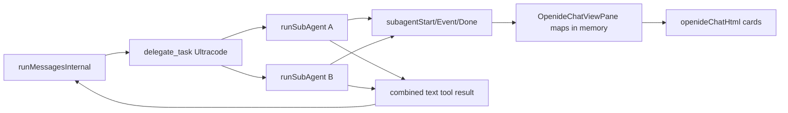
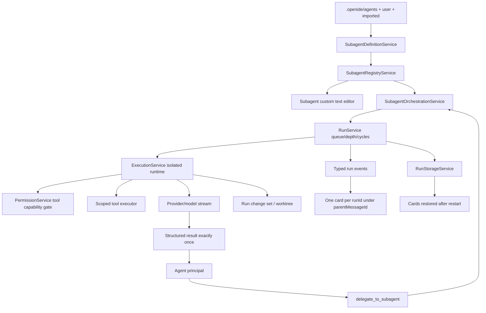

# Subagentes reales, persistentes y aislados en OpenIDE

## Contexto y decisiones

### Arquitectura actual encontrada

OpenIDE ya tiene una primera implementación acotada de subagentes para Ultracode, pero no un subsistema reutilizable de definiciones y ejecuciones persistentes:

| Área | Implementación actual | Limitación relevante |
|---|---|---|
| Chat y mensajes | `OpenideChatViewPane` mantiene la conversación activa y usa `OpenideChatSessions`; cada mensaje user puede tener `messageId` | Los subagentes se rastrean en mapas en memoria de la vista y no están modelados como runs persistentes asociados por `parentMessageId` |
| Loop principal | `OpenideAgentService.runMessages()` serializa todo con un único `OpenideRunSequencer`; `runMessagesInternal()` resuelve provider/modelo, compactación, tools, aprobación y eventos | El secuenciador global no sirve para background real; los nuevos runs necesitan runtimes y colas independientes |
| Delegación existente | `delegate_task` existe únicamente en modo Ultracode; acepta 2–6 `{ title, prompt }`, lanza `Promise.all()` y usa `runSubAgent()` | Solo foreground, profundidad 1, read-only fijo, sin definiciones persistentes, sin status/result APIs ni background desacoplado |
| Ejecución actual de subagente | `runSubAgent()` crea su propio array de mensajes, guard de tools y token hijo; filtra tools `risk === safe` | Reutiliza el registry/global runtime; tiene límites fijos 12×12; no tiene run model, storage, métricas, timeout configurable, nesting ni ownership de rollback |
| Tools | `OpenideToolRegistry` registra tools y las invoca con contexto léxico `messageId`; cada tool declara `risk` | Falta un capability set por run y un permiso de subagente que rechace tools antes de approvals; `safe` no equivale necesariamente a readonly de subagente |
| Permisos | `OpenideApprovalManager` es fail-closed para write/exec y soporta políticas globales | Las aprobaciones globales no deben habilitar una tool prohibida por la definición readonly; hace falta un gate anterior específico del run |
| Modelos | Providers/protocolos/modelos se resuelven en `OpenideAgentService`; `OpenideModelCatalog` aporta límites; el webview recibe grupos conectados | El registry de subagentes debe validar el target configurado contra providers conectados y permitir `default` sin hardcodear modelos |
| Sesiones | `OpenideChatSessions` persiste mensajes, tabs, usage y change sets por `messageId` | Los runs necesitan almacenamiento separado pero vinculado a la conversación; no conviene inflar el transcript ni depender de tool results para restaurar cards |
| UI de tool calls | `openideChatHtml.ts` tiene `delegation-group`, una card por hijo, streaming de tool calls y vista “Agentes” | Debe desacoplarse de `delegate_task`, usar `runId`, `parentMessageId`, timeline persistido y una card por ejecución; el resumen “Delegated” debe usar color neutro |
| Rollback | `OpenideMessageChangeSetService` captura operaciones estructuradas por `messageId`, persiste snapshots abiertos y aplica reverse patches con conflictos | Los subagentes escritores necesitan change set por `runId`, aislamiento de workspace y vínculo explícito con `parentMessageId`; no deben compartir builder con el padre |
| Watchers | `OpenideAgentCommands` muestra el patrón correcto: `IFileService.watch`, `onDidFilesChange`, caché invalidada, scan no recursivo y precedencia proyecto | Reutilizar el patrón en el registry de agentes; no copiar el parser YAML mínimo de skills porque aquí hay arrays, aliases y validación estricta |
| Custom editors | Plan/Canvas usan `EditorInput`, resolver por glob y `OpenideOverlayWebviewEditor` | Para undo/redo, dirty state, autosave y diff conviene basar el editor de agentes en un text model/working copy real; el webview visual debe editar el mismo documento, no escribir directo como storage paralelo |
| Comandos/configuración | `openideAgent.contribution.ts` registra Action2, editor resolvers y settings; `settingsLayout.ts` organiza categorías | Agregar sección Subagents y comandos sin crear otra infraestructura de contribuciones |

### Flujo actual de delegación

### Arquitectura objetivo

Separar el subsistema en servicios decorados del workbench, con tipos comunes JSON-serializables y sin estado global mutable por run:

### Decisiones principales

1. **Markdown es la fuente de verdad.** No habrá una base paralela para definiciones. El registry produce snapshots inmutables derivados del archivo.
2. **Parser/serializer de frontmatter dedicado.** Debe soportar scalars, booleanos y arrays, preservar cuerpo y comentarios no tocados cuando sea posible, canonicalizar `is_background`, y devolver rangos de diagnóstico. Si no existe parser YAML reutilizable apropiado en el core, implementar un parser limitado y explícito para este esquema, sin aceptar YAML arbitrario.
3. **Run separado del transcript.** `ISubagentRun` y su timeline viven en `SubagentRunStorageService`; el transcript solo conserva la referencia/card y el resultado que se entrega al padre.
4. **Identidades obligatorias.** Cada run tiene `runId`, `definitionId`, `parentConversationId`, `parentMessageId`, `parentRunId?` y `depth`; la UI nunca agrupa por índice visual.
5. **Background real.** No usar `runMessages()` ni su secuenciador global para hijos. Crear un runtime por ejecución con `CancellationTokenSource`, mensajes, guard de loops, counters, stream y approvals propios.
6. **Tools por capability.** Crear un executor scoped que recibe un conjunto de nombres autorizados. El gate de `ISubagentPermissionService` corre antes de hooks/aprobación/invoke. `readonly` remueve write/exec/git/browser mutante independientemente del prompt.
7. **Terminal readonly deshabilitada inicialmente.** Es más seguro que intentar clasificar comandos por texto. Una allowlist estructurada puede agregarse después.
8. **Escritores aislados.** Primera implementación: worktree Git temporal cuando sea viable; fallback single-writer lock cuando el repo/provider no soporte worktrees. Nunca dos escritores sobre el mismo workspace.
9. **Change sets por run.** Extender/generalizar el motor actual para un owner `{ messageId, runId? }`, con storage por run y rollback que exige ambos vínculos.
10. **Resultados exactamente una vez.** Persistir `deliveryState: pending|delivered`; los eventos tardíos se descartan por generation/status terminal.
11. **Nesting explícito.** La tool de delegación solo aparece si la definición la autoriza, `depth < maxDepth`, no hay definición repetida en ancestors y hay cupo de concurrencia.
12. **UI por ejecución.** Cada `runId` crea una card propia inmediatamente bajo el turno de `parentMessageId`, incluso si comparte una llamada de orquestación. La card “Delegated” padre queda como resumen opcional y su icono pasa a `var(--vscode-descriptionForeground)`, nunca morado.
13. **Editor con text model real.** Registrar un editor para `**/.openide/agents/*.md` y compatibilidad importada. Mantener un `ITextModel`/working copy para dirty, undo/redo, autosave y diff; controles visuales aplican ediciones al text model, y el editor inferior usa Monaco sobre ese mismo model. “Open as Text” fuerza `DEFAULT_EDITOR_ASSOCIATION`.
14. **No depender de chain-of-thought.** Timeline y métricas contienen estados, tool calls, archivos y resultados, no razonamiento privado.

### Puntos de extensión disponibles

- `OpenideAgentService`: extracción progresiva del runtime de provider y tool loop; registrar las tools de subagentes y publicar las definiciones disponibles en el system prompt.
- `OpenideToolRegistry`: exponer metadata/capabilities y una invocación scoped; conservar la implementación de cada tool.
- `OpenideChatViewPane`: reemplazar mapas `_subagentSessions` por servicios de run/storage, enviar eventos tipados al webview y resolver invocación manual `@agent`.
- `OpenideChatSessions`: guardar únicamente referencias de runs por conversación o delegar enteramente al run storage con `conversationId` indexado.
- `openideChatHtml.ts`: evolucionar cards existentes a renderer por `runId`, timeline y restauración; ajuste neutro inmediato de `.delegation-summary-icon`.
- `OpenideMessageChangeSetService`: extraer ownership genérico o crear wrapper de change sets de run sin duplicar motor de patches.
- `openideAgent.contribution.ts`: DI, editor resolver, comandos, settings y menús.
- `OpenideOverlayWebviewEditor`/custom text editor patterns: base visual, pero con text model real para el editor especializado.
- `OpenideAgentCommands`: patrón de scan/watch/precedencia para el registry.
- `OpenideModelCatalog` y APIs de providers existentes: validación/resolución de modelos.
- `OpenideApprovalManager`: reutilizable después del gate duro de permisos del subagente.

## Archivos a tocar

### Archivos existentes

| Ruta | Cambio previsto |
|---|---|
| `vscode/src/vs/workbench/contrib/openideAgent/common/openideAgentTypes.ts` | Tipos JSON-serializables de definición, run, estado, resultado, métricas, timeline, context selection, delivery y eventos; extender ownership de change sets con `runId` opcional |
| `vscode/src/vs/workbench/contrib/openideAgent/browser/openideAgentService.ts` | Reducir delegación inline actual; integrar orchestrator/tools, catálogo de definiciones en prompt, runtime factory y entrega de resultados al padre; mantener agente principal intacto |
| `vscode/src/vs/workbench/contrib/openideAgent/browser/openideTools.ts` | Metadata/categorías de tools y executor scoped; enforcement por contexto de run; eventos de edición con `runId` además de `messageId` |
| `vscode/src/vs/workbench/contrib/openideAgent/browser/openideChatView.ts` | Asociar cards a `parentMessageId`, consumir eventos del run service, invocación manual, apertura/cancelación, restauración y eliminación de mapas efímeros actuales |
| `vscode/src/vs/workbench/contrib/openideAgent/browser/openideChatSessions.ts` | Índice durable de `runId` por conversación/mensaje y migración fail-safe; no duplicar timeline completo si run storage lo contiene |
| `vscode/src/vs/workbench/contrib/openideAgent/browser/openideChatHtml.ts` | Card independiente por run, timeline expandible, métricas, acciones; selección `@agent`; restauración por snapshots; icono Delegated neutro |
| `vscode/src/vs/workbench/contrib/openideAgent/browser/openideMessageChangeSetService.ts` | Ownership por run, snapshots separados y API de rollback exacto por `{ parentMessageId, runId }`; preservar motor actual |
| `vscode/src/vs/workbench/contrib/openideAgent/browser/openideAgent.contribution.ts` | Registrar servicios, editor/input/resolver, comandos, menús y configuración Subagents |
| `vscode/src/vs/workbench/contrib/preferences/browser/settingsLayout.ts` | Categoría `openideAgent/subagents` y orden de settings |
| `.github/workflows/ci-openide.yml` | Incluir nuevas suites common/browser y, si corresponde, tests de editor/worktree |

### Archivos nuevos

| Ruta propuesta | Responsabilidad |
|---|---|
| `common/openideSubagentTypes.ts` | Contratos y guards/normalización puros |
| `common/openideSubagentDefinition.ts` | Parser/serializer de frontmatter, canonicalización y diagnósticos puros |
| `browser/openideSubagentDefinitionService.ts` | Leer/escribir archivos preservando prompt/comentarios y aplicar text edits |
| `browser/openideSubagentRegistryService.ts` | Scan no recursivo, precedencia, watchers, snapshots inmutables y `onDidChangeRegistry` |
| `browser/openideSubagentPermissionService.ts` | Capability policy, readonly hard gate, nesting/depth/cycle checks y tool denial events |
| `browser/openideSubagentRunService.ts` | Máquina de estados, queue/concurrency, CTS por run, typed events, métricas y result-once |
| `browser/openideSubagentRunStorageService.ts` | Persistencia durable, migrations, interrupted-on-reload y delivery state |
| `browser/openideSubagentExecutionService.ts` | Runtime aislado: provider/model, stream, messages, scoped tools, timeout, result normalization |
| `browser/openideSubagentOrchestrationService.ts` | Foreground/background, context selection, parent delivery, nesting y APIs status/await/cancel/result |
| `browser/openideSubagentWorkspaceService.ts` | Worktree por escritor, fallback single-writer lock, apply/discard/open/cleanup |
| `browser/openideSubagentChangeSetService.ts` | Adaptador entre run ownership y motor existente de change sets/rollback |
| `browser/openideSubagentInput.ts` | EditorInput para definición Markdown real |
| `browser/openideSubagentEditor.ts` | Editor especializado respaldado por text model/working copy |
| `browser/openideSubagentHtml.ts` | UI visual tematizada, Monaco inferior y validación inmediata |
| `test/common/openideSubagentDefinition.test.ts` | Parser, aliases, serializer, diagnostics y preservación |
| `test/browser/openideSubagentRegistryService.test.ts` | Discovery, precedence, watchers y duplicados |
| `test/browser/openideSubagentPermissionService.test.ts` | Readonly/tool gate/cycles/depth |
| `test/browser/openideSubagentRunService.test.ts` | Estados, concurrencia, timeout, cancelación, exactly-once |
| `test/browser/openideSubagentExecutionService.test.ts` | Context isolation, tools, foreground/background y eventos |
| `test/browser/openideSubagentRunStorageService.test.ts` | Reload/interrupted/delivery/persistencia |
| `test/browser/openideSubagentWorkspaceService.test.ts` | Worktree, fallback lock, apply/conflict/cleanup |
| `test/browser/openideSubagentEditor.test.ts` | Sincronización bidireccional/dirty/undo/autosave/diagnósticos |
| `test/browser/openideSubagentChatFlow.test.ts` | parentMessageId, cards por run, parallel runs y no mezcla de events |

Los nombres exactos pueden ajustarse a las convenciones de DI durante implementación, pero no se consolidarán todos los servicios en un solo archivo.

## Validación y revisión

### Estrategia de pruebas por requisito

| Requisitos | Suite |
|---|---|
| Discovery proyecto/global/importado, precedencia, edit/create/delete/rename, YAML inválido | Registry + definition common/browser |
| Editor visual ↔ Markdown, aliases, comentarios, dirty, undo/redo, autosave, Open as Text | Editor browser |
| Foreground/background, dos runs paralelos, cola, timeout, cancel individual | Run + orchestration browser |
| Readonly intentando escribir, tool bloqueada, terminal deshabilitada | Permission + execution browser |
| Result exactly-once, late/duplicate/out-of-order events | Run service tests con scheduler controlado |
| Persistencia/restart/interrupted/no redelivery | Run storage + chat restore |
| `parentMessageId`, run nesting, cycles, depth, parent cancellation | Orchestration + chat flow |
| No CTS/messages/tool calls/change sets compartidos | Execution isolation tests por identidad y eventos intercalados |
| Writer worktree, lock fallback, apply conflict, cleanup | Workspace service tests sobre repo temporal |
| Rollback por `runId` sin afectar padre/otros mensajes | Change set integration |
| Definition deleted mid-run | Registry snapshot + execution test: el run conserva snapshot inmutable |
| Model configured/default/unavailable | Registry validation + runtime resolution |

### Validaciones técnicas

1. `get_diagnostics` sobre todos los archivos modificados.
2. `npm run compile-check-ts-native`.
3. `npm run compile` al cierre de las etapas de editor y ejecución.
4. Tests common con Mocha para parser/guards.
5. Tests browser Chromium para servicios, custom editor, storage y chat flow.
6. Tests de worktree en repo temporal, salteados únicamente cuando Git no esté disponible y con fallback probado aparte.
7. Lint de `src/vs/workbench/contrib/openideAgent`; si persiste el faltante preexistente de `extensions/copilot/.eslintplugin`, documentarlo sin ocultar errores propios.
8. `valid-layers-check` con memoria suficiente; no introducir nuevas dependencias electron-main en browser.
9. Revisión adversarial al final de cada etapa y revisión final enfocada en aislamiento, permisos, exactly-once, paths/worktrees, persistencia y carreras.
10. Validación visual en la app real: dark/light theme, una card por run, cards bajo el mensaje correcto, expansión/timeline, background concurrente y restauración después de reload.

### Foco de revisión adversarial

- Ningún estado mutable compartido entre runtime padre e hijos.
- Ningún `readonly` depende del prompt.
- Ninguna tool fuera de capability set alcanza approval/invoke.
- Background no usa el secuenciador del padre ni bloquea su cola.
- Eventos y resultados idempotentes por `runId` + sequence/generation.
- Persistencia no revive runs como activos ni redelivery de resultados.
- Worktree y fallback lock no mezclan writers.
- Change set y rollback exigen run/message owners correctos.
- Custom editor no guarda estado paralelo ni destruye frontmatter/comentarios.
- Registry no hace scans recursivos ilimitados ni entrega objetos mutables compartidos.

## Límites de commit

La implementación debe separarse en commits atómicos y revisables:

1. **Tipos + parser + registry + tests.** No incluir ejecución ni UI.
2. **Run model + storage + queue + permisos + tests.** No incluir editor ni tool del padre.
3. **Execution/orchestration + tools foreground/background + tests.** Incluye migración de `delegate_task` y APIs status/await/cancel/result.
4. **Writer isolation + run change sets/rollback + tests.** Worktree y fallback lock deben ir juntos con enforcement.
5. **Custom editor + commands + settings + tests.** Editor visual y Markdown real como una unidad.
6. **Chat cards + manual invocation + persistence UI + tests.** Incluye card por run y ajuste de icono neutro.
7. **CI/docs/integration hardening.** Solo después de pasar revisión funcional completa.

No mezclar refactors generales del agente, cambios de branding ni archivos ajenos del workspace en estos commits.

## Riesgos y fuera de alcance

### Riesgos

1. **Tamaño del cambio.** Cruza runtime, storage, editor, Git y UI; se mitiga con etapas y contratos comunes primero.
2. **Run sequencer actual.** Reutilizarlo bloquearía background; hay que extraer un runtime independiente sin duplicar protocolos.
3. **Webview editor vs working copy.** Es el punto más delicado para dirty/undo/autosave. La UI no debe escribir directamente a disco saltándose el text model.
4. **YAML.** Un parser demasiado permisivo o un serializer completo puede destruir comentarios. Se limitará el esquema y se aplicarán text edits focalizadas.
5. **Worktrees.** Repos no Git, cambios sin commit, submódulos, Windows locks y cleanup fallido requieren fallback explícito y estados recuperables.
6. **Storage.** Timelines/tool outputs pueden crecer; se persistirán resúmenes capados, métricas y referencias, no streams infinitos ni imágenes/base64.
7. **Provider/model lifecycle.** Un modelo configurado puede desaparecer; el run debe fallar claro o resolver `default`, nunca cambiar silenciosamente a otro modelo incompatible.
8. **Background delivery.** La conversación padre puede cerrarse/archivarse; el resultado queda pendiente durablemente y se entrega una vez cuando el hilo pueda recibirlo.
9. **Cambios de definición durante run.** El run usa snapshot versionado capturado al crear; no cambia sus permisos a mitad de ejecución.
10. **Imported definitions.** `.cursor/agents` será read/import compatibility con precedencia menor; al guardar desde el editor se ofrecerá migrar/canonicalizar a `.openide/agents` o se editará explícitamente el recurso importado según permisos.

### Fuera de alcance inicial

- Compartir chain-of-thought o reasoning interno.
- Detección de seguridad de terminal por análisis textual heurístico.
- Ejecución distribuida/remota de subagentes.
- Merge automático agresivo de worktrees con conflictos.
- Scaneo recursivo de carpetas arbitrarias.
- Secretos o credenciales dentro de definiciones Markdown.
- Compatibilidad completa con dialectos/branding internos de otros productos; solo importación de campos compatibles.

## Tareas

- [x] Agregar tipos comunes, guards y máquina de estados de definición/run/result/eventos con `runId`, `parentConversationId`, `parentMessageId`, `parentRunId`, depth, métricas y delivery state.
- [x] Implementar parser/serializer puro del frontmatter de subagentes con `is_background` canónico, alias `background`, tools array, rangos de diagnóstico y preservación del prompt/comentarios.
- [x] Implementar `ISubagentDefinitionService` para leer, validar y aplicar ediciones focalizadas al Markdown fuente.
- [x] Implementar `ISubagentRegistryService` con scans no recursivos de proyecto/global/importado, precedencia, duplicados, snapshots inmutables, watches y eventos tipados.
- [x] Registrar diagnósticos de definiciones inválidas y limpiar markers al corregir/eliminar archivos.
- [x] Implementar `ISubagentRunStorageService` con migración, límites de tamaño, estados terminales, `interrupted` al reload y entrega exactly-once.
- [x] Implementar `ISubagentRunService` con máquina de estados, queue, máximo paralelo configurable, timeout y `CancellationTokenSource` independiente por run.
- [x] Implementar `ISubagentPermissionService` con capability sets, readonly hard gate, terminal deshabilitada, depth/cycle checks y eventos de tool bloqueada.
- [x] Extraer una factory de runtime provider/model del `OpenideAgentService` para reutilizar protocolos sin compartir mensajes, counters, approvals, streams ni abort state.
- [x] Implementar `ISubagentExecutionService` con mensajes aislados, streaming tipado, tools scoped, métricas, result estructurado y descarte de eventos tardíos.
- [x] Implementar `ISubagentOrchestrationService` para foreground/background, parent delivery, status/await/cancel/result, nesting y snapshots de definición.
- [x] Reemplazar `delegate_task` acotado por `delegate_to_subagent` y tools de status/await/cancel/result; mantener alias/migración de conversaciones Ultracode existentes.
- [x] Publicar al agente principal únicamente nombres/descripciones del registry y resolver toda invocación contra el registro para impedir nombres inventados.
- [x] Implementar invocación manual con `@agent`, comando, editor, context menu y selector del chat.
- [x] Implementar `ISubagentWorkspaceService`: worktree temporal por writer y fallback single-writer lock, con apply/discard/open/cleanup y estados de conflicto.
- [x] Extender change sets para ownership por `runId` + `parentMessageId`, captura incremental durable y rollback exacto sin mezclar padre/hijos.
- [x] Registrar `OpenideSubagentInput`, resolver por glob y editor especializado respaldado por text model/working copy real.
- [x] Implementar UI del editor: Name, Model, Description, Read-only, Background, Tools, prompt Monaco, diagnostics, visual/Markdown y sincronización bidireccional.
- [x] Agregar Open as Text/Open as Subagent Editor, create/open/run/background/cancel/show/reload commands y menús contextuales.
- [x] Agregar sección Settings `OpenIDE > Agent > Subagents` y todas las opciones de enabled/concurrency/depth/timeout/model/background/writers/worktrees/details/preservation/global dir.
- [x] Evolucionar los eventos del chat y `openideChatHtml.ts` para crear una card independiente por `runId` bajo el `parentMessageId`, con timeline, métricas, hijos y acciones.
- [x] Cambiar inmediatamente el icono de resumen Delegated a color neutro (`descriptionForeground`) y mantener colores de estado únicamente en badges/estados.
- [x] Persistir referencias de runs por conversación/mensaje y restaurar cards terminadas/interrumpidas sin marcarlas activas ni redeliver resultados.
- [x] Añadir tests unitarios de definición/parser/serializer y tests browser de registry/watchers/precedencia/diagnósticos.
- [ ] Añadir tests de ejecución foreground/background, paralelismo, cola, timeout, cancelación, aislamiento de CTS/messages/tools y resultado exactly-once.
- [ ] Añadir tests de readonly/tool gate, nesting/cycles/depth, definición eliminada mid-run y modelo configurado/no disponible.
- [ ] Añadir tests de worktree/fallback lock, apply conflict, run change set, rollback por runId y no mezcla de writers.
- [ ] Añadir tests del editor visual/Markdown, dirty/undo/autosave/diff y commands.
- [ ] Añadir tests de chat para parentMessageId, una card por run, eventos intercalados, restore, parent cancel + background y no mezcla de tool calls.
- [x] Ejecutar diagnósticos, typecheck, compile, common/browser tests, lint, valid-layers y build; corregir errores propios y documentar solo bloqueos preexistentes.
- [x] Ejecutar revisión adversarial por etapa y final sobre aislamiento, permisos, background, worktrees, persistencia, exactly-once y rollback; preparar commits atómicos sin cambios ajenos.
