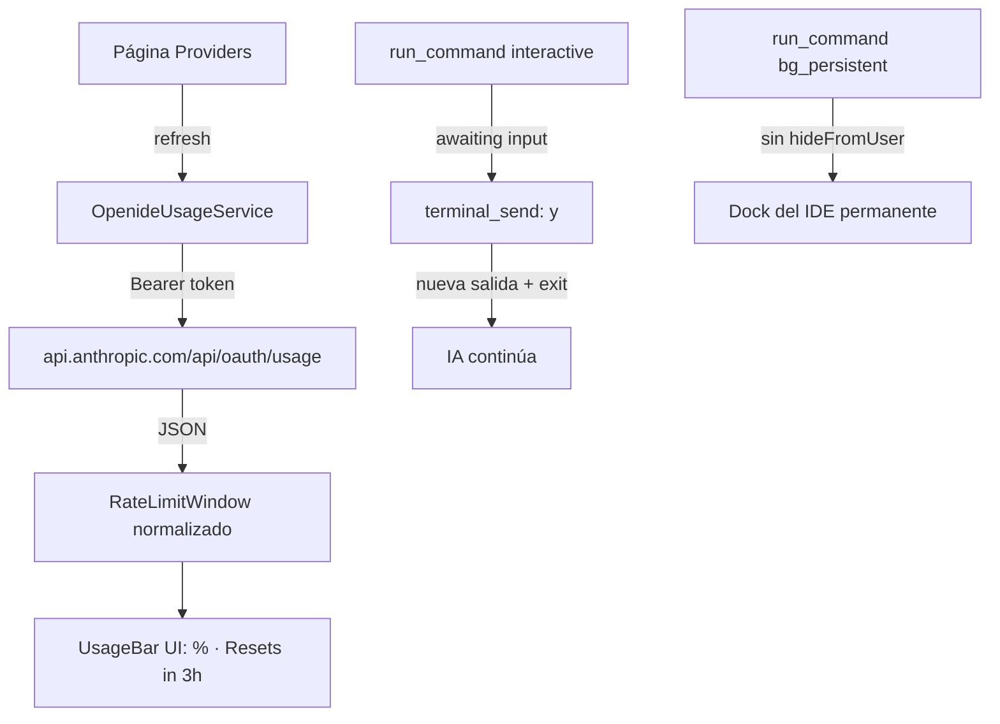

# Terminal interactiva + dock persistente · Usage/billing por provider

## Contexto y decisiones

### Feature 1: Terminal interactiva para la IA

**Estado actual:** `run_command` lanza comandos en una terminal oculta (`getAgentTerminal`) con shell integration. El usuario puede escribir en la terminal embebida del chat (`termWrite` → `writeToAgentTerminal`), pero **la IA no tiene una tool para leer la salida intermedia ni responder prompts**. Si un comando pide `y/N`, la IA queda bloqueada esperando el `exitCode` que nunca llega hasta el timeout (120s). Las terminales background usan `hideFromUser: true` → no aparecen en el dock del IDE.

**Decisión 1A — tool `terminal_send`:** nueva tool `safe` que permite a la IA escribir a la terminal activa del agente mientras `run_command` está en vuelo. Pero el problema real es que `runShellCaptured` es **bloqueante**: espera `onCommandFinished` que no se dispara si el proceso está pausado esperando input. La solución es:

1. Hacer que `runShellCaptured` detecte cuando el proceso está esperando input (sin comando nuevo por N segundos con data activa) y retorne un resultado parcial tipo `awaiting-input` en vez de timeout.
2. Nueva tool `terminal_send` que escribe a la terminal del último `run_command` activo y retorna la salida nueva acumulada.
3. La IA puede entonces: lanzar `run_command`, ver "awaiting input", llamar `terminal_send("y")`, y volver a leer.

En realidad, más simple y robusto: **unificar en `run_command` con `interactive: true`**. Cuando `interactive` es true, la terminal se mantiene visible y la tool retorna periódicamente la salida acumulada sin esperar exit code, permitiendo a la IA encadenar `terminal_send`. El flujo:

```
run_command("npm install", { interactive: true }) → "salida parcial... esperando input"
terminal_send("y") → "salida nueva tras el y..."
run_command("exit_code_check") o terminal_send se completa con exit 0
```

Pero esto rompe el modelo de tool-call/response del agent loop. **La solución más práctica** es: `run_command` ya streamea via `_onDidShellData`. Si el comando pide input y la IA lo detecta en el stream, puede llamar `terminal_send` (que escribe al pty). El problema es que `runShellCaptured` NO retorna hasta que termina. 

**Solución adoptada:** `run_command` con detección de prompt interactivo. Cuando `runShellCaptured` detecta que el proceso lleva >8s sin terminar pero **con data reciente** (hay output pero no exit), retorna `{ output, exitCode: undefined, awaitingInput: true }`. La tool devuelve `"awaiting input: <últimas líneas>"`. La IA llama `terminal_send("y")` que escribe al pty. Luego la IA llama `run_command` con `{ continue_last: true }` o simplemente `terminal_send` retorna el resultado acumulado + exit code cuando termina.

Más simple: **`terminal_send` siempre escribe al pty activo y retorna la nueva salida acumulada + exit code si terminó**. No necesita `continue_last`. El agent loop ya soporta tool calls secuenciales.

**Decisión 1B — dock persistente:** agregar `background_persistent: true` a `run_command` que crea la terminal **sin** `hideFromUser: true` y **sin** auto-dispose al terminar. La terminal queda viva en el panel del IDE. Además, en los 3 puntos de la card de terminal (foreground), agregar opción "Enviar al panel" que transfiere la terminal oculta al dock.

### Feature 2: Usage/billing por provider (inspirado en Orca)

**Estado actual:** OpenIDE no muestra usage/credits. El `AnthropicProvider` ya usa OAuth Bearer con `oauth-2025-04-20`. El catálogo de providers (`openideProviderCatalog.ts`) tiene la config OAuth de cada provider. Las credenciales se guardan en secret storage.

**Endpoints de Orca confirmados:**
- **Claude (Anthropic OAuth):** `GET https://api.anthropic.com/api/oauth/usage` con `Authorization: Bearer <token>`, `anthropic-beta: oauth-2025-04-20`, `User-Agent: claude-code/2.1.0`.
- **Gemini (Google OAuth):** `POST https://cloudcode-pa.googleapis.com/v1internal:retrieveUserQuota` con bearer.
- **Codex/OpenAI:** CLI `/status` RPC (complejo; skip inicial para API keys).

**Tipos de Orca:**
```ts
RateLimitWindow = { usedPercent: 0-100, windowMinutes: 300|10080, resetsAt: number|null, resetDescription: string|null }
ProviderRateLimits = { provider, session: RateLimitWindow|null, weekly: RateLimitWindow|null, ... }
```

**UI de Orca:** `UsageBar` con track horizontal, fill coloreado por banda (green<60, amber<80, red≥80), label de %, y countdown "Resets in 3h 54m".

**Decisión 2:** Implementar un servicio `OpenideUsageService` que:
1. Consulta `https://api.anthropic.com/api/oauth/usage` para providers OAuth de Anthropic.
2. Devuelve `IRateLimitWindow[]` normalizados.
3. Se invoca bajo demanda desde la página de Providers (botón refresh) y opcionalmente con polling.
4. La página de Providers muestra un `UsageBar` por provider conectado con % usado y countdown.

**Scope inicial:** sólo Anthropic OAuth (el provider más usado y el endpoint más simple). Gemini y otros se agregan después.



## Archivos a tocar

| Ruta | Cambio |
|---|---|
| `openideTools.ts` | `runShellCaptured`: detectar awaiting-input (timeout parcial con data reciente). `runCommandTool`: param `background_persistent`. Nueva tool `terminalSendTool`. Exponer terminal activa para escritura IA. |
| `openideAgentService.ts` | Interceptar `terminal_send` (como ask_user): escribir al pty activo, retornar salida acumulada + exit si terminó. Registrar tool. |
| `openideAgentTypes.ts` | Tipo `IAgentTool` ya soporta invoke con token; agregar evento opcional `terminalOutput` para streaming hacia la IA. |
| `openideChatHtml.ts` | Menú 3-puntos de term card: agregar "Enviar al panel". CSS para indicador awaiting-input. |
| `openideChatView.ts` | Handler `termToPanel` que hace la terminal visible en el dock. |
| `openideUsageService.ts` (NUEVO) | Servicio: fetch OAuth usage, normalizar a `IRateLimitWindow`, caché, refresh. |
| `openideProvidersHtml.ts` | UI: UsageBar por provider conectado + countdown + botón refresh. |
| `openideProvidersEditor.ts` | Cablear `OpenideUsageService` al webview. |
| `openideAgent.contribution.ts` | Settings: `openide.agent.usage.enabled`, `openide.agent.usage.pollMinutes`. |
| `test/common/openideTerminalInteractive.test.ts` (NUEVO) | Tests de detección awaiting-input y normalización de usage. |

## Validación y revisión

1. `npm run compile-check-ts-native`.
2. Tests common: detección de awaiting-input, parsing de usage JSON, normalización.
3. Tests browser: menú de terminal con "Enviar al panel".
4. `review_changes` adversarial: seguridad de terminal_send (no escribir a pty equivocado), timeouts, y que usage no filtre tokens.
5. Build completo + AppImage + actualizar desktop.

## Límites de commit

- **Commit 1 — terminal interactiva:** tools + detección + UI del menú + tests.
- **Commit 2 — usage/billing:** servicio + UI de providers + settings + tests.

## Riesgos y fuera de alcance

- `terminal_send` sólo escribe a la terminal del último `run_command` activo del mismo run; no puede escribir a terminales arbitrarias del usuario.
- La detección de awaiting-input es heurística (N segundos sin exit + data reciente); puede haber falsos positivos en comandos lentos con output continuo.
- Usage inicial: sólo Anthropic OAuth. API keys y otros providers se agregan después.
- No se implementa reset credits ni redeem (complejo y específico de Orca).
- El polling de usage es opcional y deshabilitado por defecto (privacy/billing).

## Tareas

- [x] Modificar `runShellCaptured` para detectar awaiting-input (data reciente sin exit code) y retornar resultado parcial.
- [x] Agregar tool `terminal_send` al registry: escribe al pty activo y retorna salida + exit code.
- [x] Interceptar `terminal_send` en `openideAgentService` para escribir al pty y acumular salida.
- [x] Agregar param `background_persistent` a `run_command`: terminal visible en el dock sin auto-dispose.
- [x] Agregar opción "Enviar al panel" en el menú de 3 puntos de la term card del chat.
- [x] Handler `termToPanel` en `openideChatView` que revela la terminal en el dock del IDE.
- [x] Crear `OpenideUsageService`: fetch `api.anthropic.com/api/oauth/usage`, normalizar a `IRateLimitWindow`.
- [x] Agregar UI de UsageBar en la página de Providers con % usado, banda de color y countdown.
- [x] Cablear el servicio de usage al editor de providers (refresh bajo demanda).
- [x] Registrar settings `openide.agent.usage.enabled` y `openide.agent.usage.pollMinutes`.
- [x] Agregar tests de detección awaiting-input y parsing de usage.
- [x] Ejecutar compile-check, tests y revisión adversarial.
- [ ] Build completo de VSCode-linux-x64, empaquetar AppImage y actualizar desktop OpenIDE.
