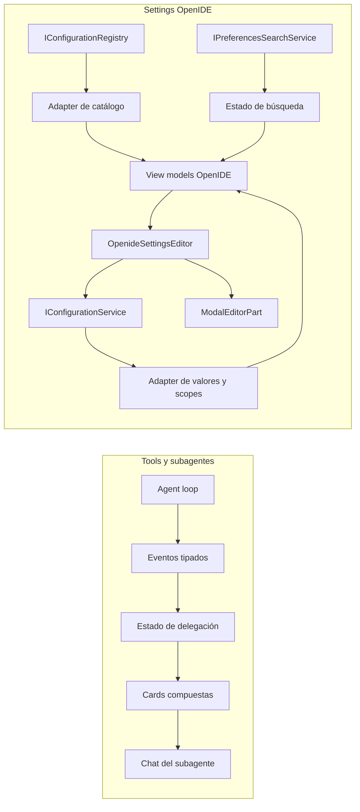

# Tools visuales y Settings propio de OpenIDE

## Objetivo

Implementar dos mejoras coordinadas, manteniendo la infraestructura y los contratos de Code OSS pero reemplazando las superficies visuales por componentes propios de OpenIDE:

1. Rediseñar `delegate_task` para que una delegación se vea como una operación compuesta: una card por subagente con estado, título, modelo, cantidad de tools, acceso a su conversación y expansión del detalle; al finalizar, una fila resumen de la tool padre.
2. Reemplazar el frontend heredado de Settings por una experiencia modal, diseñada desde cero para OpenIDE, capaz de mostrar y editar todos los ajustes del IDE, OpenIDE y las extensiones.

## Decisiones confirmadas

- Settings se abre como **modal flotante**, no como una pestaña estándar.
- La primera versión funcional debe abarcar **todo el catálogo de settings**, no sólo los ajustes de OpenIDE.
- El diseño no copiará la estructura visual de VS Code. Se reutilizarán sus servicios de configuración, modelos y registros únicamente como backend.
- `vscode/` es la fuente de verdad. Las features viven directamente bajo `vscode/src/`; no se implementarán como patches.
- La referencia de `delegate_task` define una operación visual compuesta:
  - subagentes como cards hermanas;
  - estado a la izquierda;
  - título principal;
  - modelo y contador de herramientas como metadata;
  - acción para abrir la conversación;
  - chevron para expandir/contraer;
  - resumen final de la tool `Delegated`.

## Estado actual relevante

### Delegación

El flujo ya emite eventos independientes:

- `subagentStart`
- `subagentEvent`
- `subagentDone`
- `toolStart` y `toolResult` para la invocación padre `delegate_task`

Los subagentes se ejecutan en paralelo con `Promise.all()` dentro de `openideAgentService.ts`. La UI actual ya crea `.sub-card`, cuenta tools, muestra modelo, permite abrir/cancelar y colapsa al terminar. Sin embargo, la tool padre sigue entrando al renderer genérico de tools y la composición visual no está modelada como un único bloque semántico. Esto puede producir duplicación o una jerarquía distinta de la referencia.

### Settings

El Settings visible continúa siendo `SettingsEditor2`, con CSS de OpenIDE superpuesto mediante `openideSettingsEditor.css`. Por lo tanto, el diseño sigue condicionado por el DOM, widgets, árbol y layout de VS Code.

El backend ya cubre los requisitos importantes:

- `IConfigurationRegistry` como catálogo dinámico de settings built-in y de extensiones;
- `IConfigurationService` para lectura, inspección, escritura y reset por target;
- `IPreferencesService` para apertura y resolución de recursos;
- `Settings2EditorModel`, `DefaultSettings` e `ISetting` como metadata normalizada;
- búsqueda local/remota/AI y filtros estándar;
- perfiles, remote, workspace, multi-root, policy, trust y overrides por lenguaje;
- `MODAL_GROUP` y `ModalEditorPart` como shell modal nativo.

## Arquitectura propuesta



## Línea de trabajo A — `delegate_task` como tool compuesta

### A.1 Formalizar el contrato de delegación

Extender los eventos de subagente en `openideAgentTypes.ts` para transportar explícitamente la metadata que necesita la UI, evitando inferencias desde el DOM:

- ID de la invocación padre `delegate_task`;
- índice y cantidad total de subagentes;
- título;
- modelo;
- session ID cuando esté disponible;
- estado `queued | running | completed | failed | cancelled`;
- contador de tools;
- timestamps o duración final si se decide mostrarla.

El ID padre permitirá agrupar las cards y resolver exactamente una invocación `delegate_task`, incluso si hay más de una delegación en el mismo turno.

### A.2 Ajustar la emisión de eventos

En `openideAgentService.ts`:

- generar y emitir una apertura de grupo antes del `Promise.all()`;
- asociar cada `subagentStart/Event/Done` con `call.id`;
- emitir un cierre de grupo cuando todos terminen;
- conservar ejecución paralela y cancelación individual;
- no alterar el resultado textual combinado que vuelve al modelo;
- asegurar que errores parciales no eliminen las cards exitosas.

No se cambiará la semántica de aislamiento ni el set read-only de herramientas de los subagentes.

### A.3 Introducir un estado de presentación por delegación

En el script del webview de `openideChatHtml.ts`, reemplazar el mapa global plano como única fuente por:

- `delegations[parentId]` para cada invocación padre;
- `delegation.children[subagentId]` para las cards hijas;
- estado derivado del grupo;
- contador total y completado;
- referencia a la fila resumen padre.

El renderer deberá ser idempotente frente a eventos tardíos, restauraciones o cancelaciones. Un evento repetido no podrá crear una segunda card.

### A.4 Implementar el componente visual de referencia

Construir una superficie `delegation-group` que renderice:

1. Cards hijas en el orden de las tareas solicitadas, aunque finalicen en otro orden.
2. Cada card con:
   - spinner mientras corre;
   - check verde al completar;
   - icono y estado diferenciados para error/cancelación;
   - título truncado con tooltip;
   - modelo;
   - contador `N tools` actualizado en vivo;
   - botón de abrir conversación;
   - chevron accesible para expandir/contraer;
   - body con stream resumido de texto y tools;
   - acción Stop sólo mientras corre.
3. Una fila padre `Delegated` después de las cards, visualmente coherente con las tool rows:
   - badge `TOOL`;
   - estado agregado;
   - chevron para inspeccionar argumentos/resultado del `delegate_task`;
   - sin duplicar una card genérica adicional.

La fila padre no debe aparecer como completada antes de que todos los hijos hayan terminado.

### A.5 Integrar con el renderer genérico de tools

En `renderToolStart`/`renderToolResult`:

- detectar `delegate_task` como renderer especializado;
- reservar su posición en el flujo sin mostrar la action-card genérica;
- conectar el resultado padre con el grupo existente;
- mantener el renderer genérico intacto para el resto de tools, skills y MCP.

### A.6 Accesibilidad y comportamiento

- La cabecera expandible será un `button` o tendrá semántica equivalente.
- Expondrá `aria-expanded`, estado y nombre del subagente.
- Abrir conversación y cancelar no dispararán accidentalmente el toggle.
- El orden de foco seguirá: card → abrir → cancelar → expandir.
- El estado no dependerá sólo del color.
- `prefers-reduced-motion` desactivará spinner/shimmer no esencial.

## Línea de trabajo B — Settings propio de OpenIDE

### B.1 Crear una contribución independiente

Crear:

```text
vscode/src/vs/workbench/contrib/openideSettings/
├── browser/
│   ├── openideSettings.contribution.ts
│   ├── openideSettingsEditor.ts
│   ├── openideSettingsInput.ts
│   ├── openideSettingsModel.ts
│   ├── openideSettingsSearch.ts
│   ├── openideSettingsControls.ts
│   └── media/openideSettings.css
├── common/
│   └── openideSettingsTypes.ts
└── test/
```

La contribución tendrá namespace propio y dependerá de los servicios públicos/internos existentes, no del DOM de `SettingsEditor2`.

### B.2 Mantener compatibilidad de apertura

Conservar los command IDs públicos:

- `workbench.action.openSettings`
- `workbench.action.openSettings2`
- acciones de User, Workspace, Folder y Remote;
- `settings.switchToJSON`;
- apertura con `query`, `revealSetting`, `focusSearch`, `folderUri` y target.

Durante la migración se recomienda registrar un input/pane OpenIDE paralelo y redirigir `IPreferencesService.openSettings2()` detrás de un feature flag interno. Cuando alcance paridad, el pane OpenIDE será el destino predeterminado y el antiguo quedará temporalmente como fallback de diagnóstico.

### B.3 Usar el modal nativo como shell

Abrir el input de Settings en `MODAL_GROUP`, reutilizando `ModalEditorPart` para obtener:

- backdrop;
- cierre al hacer click fuera;
- Escape y foco modal;
- redimensionado;
- maximizar/restaurar;
- integración con quick input, dialogs y z-index del workbench;
- accesibilidad `role="dialog"`.

No crear un segundo sistema de overlays ni un webview sólo para imitar un modal.

La apertura de Settings debe forzar modal para esta experiencia, independientemente de que otros editores usen `workbench.editor.useModal`, salvo en tests de extensión/smoke donde se conservará el fallback actual para evitar inestabilidad.

### B.4 Crear un adapter de catálogo, no un catálogo duplicado

`OpenideSettingsModel` consumirá `Settings2EditorModel`/`DefaultSettings` e `IConfigurationRegistry` para generar view models propios con:

- key;
- label y categoría;
- descripción plain/Markdown;
- tipo visual;
- default;
- valor del target seleccionado;
- valor efectivo;
- procedencia del valor efectivo;
- enum y descripciones;
- schemas de arrays/objetos;
- tags;
- owner de extensión;
- scope permitido;
- estado modified, deprecated, restricted, policy-controlled o disabled;
- overrides por lenguaje;
- validación.

Debe reaccionar a `onDidSchemaChange`, cambios de defaults, instalación/desinstalación de extensiones y cambios de perfil.

### B.5 Diseñar el shell visual OpenIDE

La composición propuesta del modal:

- **Header propio**: icono, título Settings y acciones de abrir JSON, maximizar/restaurar y cerrar.
- **Buscador prominente**: búsqueda textual, chips de filtros activos, limpiar y filtros avanzados.
- **Selector de scope compacto**: User, Remote cuando exista, Workspace y Folder cuando corresponda.
- **Navegación lateral propia**:
  - Inicio/Resumen;
  - Editor;
  - Workbench;
  - Window;
  - OpenIDE;
  - Agente IA;
  - Features;
  - Security;
  - Extensions;
  - categorías dinámicas restantes.
- **Contenido central**:
  - encabezado de categoría;
  - filas semánticas, no nodos del árbol de VS Code;
  - texto a la izquierda y controles alineados a la derecha en anchos amplios;
  - layout apilado en anchos reducidos;
  - indicador de modificación y acción Reset;
  - procedencia y scope visibles bajo demanda.

El visual se implementará sólo con clases `.openide-settings-*` y tokens de tema. No se reutilizarán selectores estructurales de `.settings-editor`, `.settings-tree` o `.monaco-list-row`.

### B.6 Implementar todos los tipos de setting

Controles requeridos:

- boolean → switch;
- string → input;
- multiline string → textarea;
- number/integer → input numérico validado;
- enum → select/listbox;
- array simple → lista editable;
- object/boolean-object → tabla o lista clave/valor;
- include/exclude → editor especializado de patrones;
- extension toggle;
- language-overridable;
- schemas complejos → editor estructurado cuando sea seguro y fallback explícito a JSON cuando no lo sea.

Ningún tipo desconocido debe mostrarse como editable parcialmente. Debe ofrecer `Editar en settings.json` preservando target y setting revelado.

### B.7 Lectura, escritura y reset por scope

Toda mutación pasará por `IConfigurationService` con `ConfigurationTarget` explícito. La UI distinguirá:

- valor del target activo;
- valor efectivo;
- default;
- overrides en otros targets.

Reset eliminará sólo el valor del target seleccionado. No se escribirá directamente en `settings.json` desde los controles visuales.

### B.8 Búsqueda y filtros

Reutilizar `IPreferencesSearchService` y conservar como mínimo:

- texto libre;
- `@modified`;
- `@id:`;
- `@ext:`;
- `@feature:`;
- `@lang:`;
- `@tag:`;
- `@hasPolicy`;
- filtros de workspace trust y advanced.

La vista podrá representar los resultados con navegación propia, pero mantendrá deduplicación y prioridad de providers. Las respuestas obsoletas deberán cancelarse al cambiar rápidamente la query.

### B.9 Extensiones, perfiles y entornos

La paridad funcional incluye:

- settings aportados dinámicamente por extensiones;
- extensión instalada, deshabilitada o eliminada con el modal abierto;
- User local/application;
- User Remote;
- Workspace;
- Workspace Folder en multi-root;
- perfil actual y cambio de perfil;
- language overrides;
- workspace trust;
- policy settings;
- configuración sincronizable y procedencia de defaults.

## Orden de implementación

### Fase 1 — Delegación visual

Es una mejora localizada y sirve para consolidar el lenguaje de cards que después puede inspirar componentes de Settings.

1. Contratos de eventos y agrupación por parent ID.
2. Renderer especializado de `delegate_task`.
3. Cards hijas según referencia.
4. Resumen padre y restauración.
5. Tests y validación visual.

### Fase 2 — Fundación de Settings

1. Contribución, input y editor propios.
2. Apertura modal.
3. Adapter de catálogo y valores.
4. Shell visual con búsqueda, categorías y scopes.
5. Vista read-only de todos los settings.

### Fase 3 — Edición completa

1. Tipos simples.
2. Reset y procedencia.
3. Arrays y objetos.
4. Overrides por lenguaje.
5. Fallback JSON para schemas complejos.

### Fase 4 — Paridad dinámica

1. Extensiones.
2. Profiles y Remote.
3. Multi-root.
4. Policy/trust.
5. Búsqueda completa y reveal.

### Fase 5 — Cutover

1. Redirigir comandos estándar al editor OpenIDE.
2. Mantener JSON y fallback heredado temporal.
3. Eliminar el import de `openideSettingsEditor.css` desde `SettingsEditor2` cuando ya no sea ruta principal.
4. Retirar el CSS superpuesto y código transitorio después de estabilizar.

## Archivos principales a modificar

### Delegación

- `vscode/src/vs/workbench/contrib/openideAgent/common/openideAgentTypes.ts`
- `vscode/src/vs/workbench/contrib/openideAgent/browser/openideAgentService.ts`
- `vscode/src/vs/workbench/contrib/openideAgent/browser/openideChatView.ts`
- `vscode/src/vs/workbench/contrib/openideAgent/browser/openideChatHtml.ts`
- tests nuevos bajo `vscode/src/vs/workbench/contrib/openideAgent/test/`

### Settings

- contribución nueva `vscode/src/vs/workbench/contrib/openideSettings/**`
- `vscode/src/vs/workbench/services/preferences/browser/preferencesService.ts` para el redireccionamiento mínimo de apertura
- `vscode/src/vs/workbench/contrib/preferences/browser/preferences.contribution.ts` sólo donde se requiera conservar/redirigir comandos
- registro de contribuciones del workbench correspondiente
- tests nuevos de modelo, integración y UI
- retiro posterior de `vscode/src/vs/workbench/contrib/preferences/browser/media/openideSettingsEditor.css`

## Estrategia de pruebas

### Delegación

- múltiples subagentes ejecutándose y completando fuera de orden;
- contador de tools actualizado por hijo;
- un hijo con error y otros exitosos;
- cancelación individual;
- cancelación del run padre;
- dos `delegate_task` en un mismo transcript;
- restauración de sesión sin cards duplicadas;
- apertura del chat correcto por session ID;
- fila padre emitida una sola vez;
- navegación por teclado y `aria-expanded`;
- temas dark, light y high contrast.

### Settings — unitarios

- conversión completa de schema a view model;
- categorías y orden;
- tipos y validadores;
- default, target y valor efectivo;
- reset por target;
- scopes User/Remote/Workspace/Folder;
- settings restricted, deprecated y policy-controlled;
- extensión owner y cambios de schema;
- filtros y deduplicación de resultados.

### Settings — integración

- todos los comandos `openSettings*` abren el modal correcto;
- query/reveal/focusSearch;
- UI ↔ JSON conserva target y setting;
- edición externa de JSON actualiza el modal;
- instalación/desinstalación de extensión con el modal abierto;
- cambio de profile;
- remote y multi-root;
- cierre por Escape, backdrop y botón;
- resize, maximizar/restaurar y foco atrapado.

### Settings — visual/accesibilidad

- resoluciones angostas y amplias;
- zoom;
- dark/light/high contrast;
- keyboard-only;
- lector de pantalla;
- errores de validación anunciados;
- estados disabled/restricted sin depender sólo del color;
- catálogo grande con virtualización y scroll estable.

## Validación técnica

En cada fase:

1. Ejecutar diagnósticos LSP sobre archivos tocados.
2. Compilar TypeScript con el entorno FHS documentado.
3. Ejecutar suites unitarias relevantes.
4. Abrir una instancia real de OpenIDE.
5. Validar el flujo de delegación con tres subagentes paralelos.
6. Validar Settings modal contra un workspace con múltiples carpetas y extensiones que aporten settings.
7. Revisar consola y errores del workbench.
8. Hacer checkpoints Git atómicos separados para Tools y Settings.

## Riesgos y mitigaciones

### Acoplamiento con upstream

**Riesgo:** modificar profundamente `SettingsEditor2` generaría conflictos en cada actualización.

**Mitigación:** contribución `openideSettings` independiente y cambios mínimos de registro/apertura.

### Paridad incompleta de Settings

**Riesgo:** omitir tipos complejos, profiles o settings dinámicos.

**Mitigación:** adapter basado en los contratos existentes, matriz explícita de scopes/tipos y fallback JSON.

### Rendimiento

**Riesgo:** renderizar miles de settings en el modal.

**Mitigación:** virtualización, view models estables, actualización incremental por keys afectadas y búsqueda cancelable.

### Estado inconsistente de delegaciones

**Riesgo:** eventos paralelos fuera de orden o restauración duplicada.

**Mitigación:** parent ID, índices estables, máquina de estados idempotente y fila padre derivada del estado de hijos.

### Seguridad

**Riesgo:** el rediseño visual altere aprobaciones o ejecución de tools.

**Mitigación:** esta línea modifica presentación y eventos de delegación, no `OpenideApprovalManager`, hardline deny ni políticas de tools.

## Criterios de aceptación

### `delegate_task`

- Tres tareas delegadas aparecen como tres cards hermanas, alineadas como en la referencia.
- Cada card muestra título, modelo, contador de tools, estado, abrir conversación y expandir/contraer.
- Las cards mantienen el orden solicitado aunque las tareas finalicen en distinto orden.
- La tool padre se representa una sola vez como resumen `Delegated`.
- Errores y cancelaciones son visibles y no bloquean la información de las demás tareas.

### Settings

- `Ctrl/Cmd+,` abre el Settings modal propio de OpenIDE.
- El modal no depende del DOM ni CSS de `SettingsEditor2`.
- Aparecen ajustes nativos, de OpenIDE y de extensiones.
- Se pueden buscar, revelar, editar y resetear en User, Remote, Workspace y Folder.
- Los valores efectivos, defaults y overrides se distinguen correctamente.
- Settings JSON continúa disponible como fallback y edición avanzada.
- El modal funciona con teclado, lectores de pantalla y todos los temas soportados.

## Tareas

- [x] Extender eventos de subagentes con parent ID, índice, total y estado explícito.
- [x] Crear el estado agrupado e idempotente de delegaciones en el chat.
- [x] Implementar las cards hijas de `delegate_task` según la referencia.
- [x] Reemplazar la card genérica duplicada por una fila resumen `Delegated`.
- [x] Cubrir paralelismo, error, cancelación, restauración y accesibilidad de subagentes.
- [x] Crear la contribución `openideSettings` con input, editor, modelo y estilos propios.
- [x] Abrir el nuevo Settings exclusivamente mediante el modal editor nativo.
- [x] Crear el adapter de catálogo y valores sobre registros/servicios existentes.
- [x] Implementar header, búsqueda, scopes, navegación y contenido visual OpenIDE.
- [x] Implementar todos los controles simples y reset por target.
- [x] Implementar arrays, objetos, language overrides y fallback JSON.
- [x] Integrar settings dinámicos de extensiones, profiles, Remote, multi-root, policy y trust.
- [x] Preservar comandos, query/reveal, switch a JSON y contextos de apertura existentes.
- [x] Agregar tests unitarios, de integración, browser y accesibilidad.
- [ ] Validar compile y ambos flujos en una instancia real de OpenIDE.
- [x] Retirar la capa CSS heredada de `SettingsEditor2` después del cutover.
- [x] Permitir pegar o adjuntar imágenes en respuestas de `ask_user`, mostrarlas como chips `image-N` y previsualizarlas mediante tooltip nativo.
- [x] Agregar en el header del chat un control de layout que abra un panel con el árbol de la conversación padre y sus subagentes Ultracode.
- [x] Crear una representación visual propia de la conversación padre dentro del árbol de agentes.
- [x] Permitir que el agente solicite cambios de modo (Agent, Plan, Ask, Ultracode) reutilizando la tarjeta de confirmación y bloquear el loop hasta que el usuario acepte o rechace.
