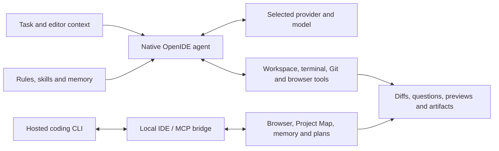

<div id="openide-logo" align="center">
  <br />
  
  <h1>OpenIDE</h1>
  <h3>An open IDE built on VS Code, with an AI agent built into the product.</h3>
</div>

---

## What is OpenIDE?

**OpenIDE** is a distribution of Visual Studio Code built on a freely-licensed
Code OSS base. The goal is a familiar editor that stays compatible with the VS
Code ecosystem, but with an AI agent experience integrated deeply into the
editor itself: the assistant is not an extension, it is part of the product,
with access to native workspace tools, local preview, change review, plans, and
persistent codebase memory.

This repository contains the complete source of OpenIDE. The product is
maintained directly on top of the Code OSS source tree — features, branding and
defaults live in the source and compile without rebuilding the application from
patches.

## Explore OpenIDE

- [Get started](./docs/getting-started.md) · [Download releases](https://github.com/Niiihuel/openide/releases)
- [Harness and complete tool reference](./docs/harness.md)
- [Memory and Project Map](#memory-and-project-map)
- [Coding CLIs inside the editor](#coding-clis-inside-the-editor)
- [Voice and provider formats](./docs/voice-transports.md)
- [Build from source](./BUILD.md) · [Documentation](./docs/index.md)

## An editor and a harness

OpenIDE combines the familiar editor, terminal, debugger, source control and
extension workflow with a native agent runtime. Its **harness** is the layer
that assembles context, calls a model, executes tools, handles permissions and
cancellation, and presents results in the workbench.

You can use OpenIDE's own agent with a connected provider, or host an installed
coding CLI in the chat dock. Both can work with the visible editor; supported
CLI integrations also receive selected OpenIDE tools through a local MCP bridge.



### Chat, modes and editing

- **Agent, Plan, Ask and Debug** — implement a task, prepare a plan, investigate
  the codebase, or diagnose a problem. Plan and Ask filter out the native file
  mutation and terminal tools. Permissions are configured separately from modes.
- **Native chat dock** — named conversations, model and provider icons, saved
  sessions, queued prompts, attachments and project context. Tool results render
  as purpose-built components alongside the conversation.
- **Reviewable changes** — inline editor diffs, full-width added/deleted lines in
  chat cards, changed-file summaries, and keep/undo actions. Background terminals,
  queued messages, questions and file changes have distinct sections near the
  composer.
- **Editor assistance** — selection-based quick edits and configurable inline
  completion, alongside full agent tasks.
- **Zen and action feedback** — focused editing with visual feedback for agent
  activity, additions, edits and deletions. Streaming UI updates are coordinated
  with rendering so the interface can keep up with incoming work.
- **Permissions and cancellation** — ask before actions, automatically allow
  edits, or allow broader execution according to the selected policy. Workspace
  guards and tool-specific checks still apply; a running task can be stopped.

### Providers, models and voice

Connect supported providers through OAuth or API keys, or add a custom
OpenAI-compatible endpoint such as a local model server or an organization proxy.
The provider layer supports multiple accounts, account switching, model
selection, capability metadata and ordered fallback on eligible failures.
Credentials are held in the editor's secret storage rather than in settings.

Model discovery combines provider responses with catalog metadata. Availability
can depend on the account, endpoint and advertised capabilities; a newly
announced model is not proof that a particular account can use it. Model and
provider settings expose discovery and refresh instead of requiring a new
composer implementation for each integration.

**Voice dictation** has its own provider and model selection. The microphone
occupies the send-button position when the composer is empty; typing replaces
it with Send. Click-to-talk and hold-to-talk modes, cancellation, a microphone
test and provider-grouped choices make recording visible before transcription
is inserted into the draft.

Audio uses a shared transport resolver with adapters for chat audio, multipart
transcription, native Gemini and other supported endpoint formats. Only models
with a compatible audio-input contract are offered as usable dictation targets.
Connected providers without a supported transport remain visible with an
explanation. See the [voice transport matrix](./docs/voice-transports.md) for
implemented formats, custom endpoints and account limitations.

### Memory and Project Map

OpenIDE keeps three complementary forms of memory:

| Layer | What it retains | How it is used |
|---|---|---|
| Project and user notes | Durable conventions, decisions, pitfalls and preferences | Project notes live in `.openide/MEMORY.md`; user preferences live in the profile. The native agent receives a snapshot and can maintain it with the `memory` tool. |
| Codebase graph | Files, symbols and their relationships, with source locations and evidence | An incremental local index supports navigation, impact analysis and retrieval of relevant context. |
| Project Map learning | Which retrieved entities proved useful or received conflicting outcome signals | Local, time-decayed signals help prioritize future context; they do not train the model. |

The graph represents **nodes** such as files, classes, functions, tests and
notes, connected by relationships such as imports, calls, references,
inheritance and test coverage links. Evidence records where a relationship came
from and its confidence. Language-service results can enrich the index;
text/regex fallback has lower certainty. Coverage depends on the language and
available providers.

Project notes can also become graph nodes. Explicit references to files or
symbols create annotation links when they resolve unambiguously, connecting a
written architectural decision to the code it describes.

**Project Map** makes those relationships explorable with a 2D canvas, community
colors, connected-node emphasis, search, filtering, pan, zoom and a minimap.
The agent can query the same underlying index for related code, callers, impact,
paths and tests, with bounded context and visible provenance/staleness metadata.
The derived index is stored outside the repository and can be rebuilt; authored
notes remain ordinary Markdown under your control.

[Read how memory, nodes and retrieval work](./docs/harness.md#memory-nodes-and-retrieval).

### Workspace tools and task orchestration

The native agent can read, search and edit files, inspect diagnostics, run
commands and interact with existing terminals. It can maintain a task list, ask
structured questions, save plans, delegate bounded tasks to configured
subagents and request an isolated review of changes.

Git tools provide working-tree inspection, configurable preflight checks and
commits with explicitly selected files. Context management supports retrieval,
automatic compaction, a configurable summarization model and token limits.
Web search and bounded page fetching provide research context separately from
the authenticated browser preview.

The [complete tool reference](./docs/harness.md#native-tool-reference) explains
each family, including browser automation, memory, Git, subagents, artifacts,
conversation coordination and dynamically discovered MCP tools. The tools a
model receives depend on its capabilities, the active mode and configuration.

### Browser, visual review and artifacts

- **Integrated browser** — open a running app in the editor, inspect its DOM,
  accessibility snapshot and console, take screenshots, and drive interactions
  with Playwright using the visible session.
- **Pick & Polish** — select an element visually and attach its selector, HTML,
  styles and screenshot to the chat for UI work.
- **Flow recordings** — record interactions into video, a contact sheet and
  keyframes. Mark important moments and inspect motion or layout findings next
  to the visual evidence.
- **Visual checks** — inspect possible clipping, broken images, contrast,
  overlapping controls and overflow. Findings guide review; they are not an
  accessibility certification or a substitute for looking at the page.
- **Plans** — `.openide/plans/*.md` open in a dedicated editor with interactive
  tasks and model selection. External agents can submit a plan and wait for
  the user's edited, approved version.
- **Canvas** — `.openide/canvases/*.canvas.tsx` artifacts render interactive
  wireframes, comparisons, tables and charts with host-themed components and
  persisted UI state. The canvas runtime has a restricted import surface.
- **Diagrams** — native rendering for supported flowcharts, state diagrams,
  mind maps, sequence diagrams, timelines, Gantt, pie, journey, quadrant and Git
  diagrams. A separate diagram MCP server exposes parsing and layout to clients.
- **Markdown QA** — validate the active document for unclosed fences, skipped
  heading levels and unsafe link schemes, with a structure report in the output
  channel.

### Coding CLIs inside the editor

The chat dock can host **Claude Code, Codex, Gemini CLI, OpenCode, Amp, Factory
Droid, Copilot CLI and Grok** as embedded terminal sessions. OpenIDE discovers
installed executables, shows their brand icons and session state, and provides
resume support where the integration defines it. The CLI keeps its own
credentials, models and permission system.

Claude Code, Codex and OpenCode have launch-scoped MCP configuration adapters.
Grok has a registration command. Other hosted CLIs can run in the dock but do
not receive automatic OpenIDE MCP configuration from the current catalog.

Through the bridge, an external agent can use the **browser the user actually
has open**, query Project Map, read and maintain shared project memory, or submit
a plan for review. Editor compatibility tools expose open files, selections,
unsaved state and diagnostics. Tool descriptions explain when to use these
capabilities, and screenshots are returned as image content.

CLI activity also feeds a visual changes view with files, statistics and diffs.
Claude hooks provide explicit activity boundaries; other integrations can use
terminal-output heuristics. Concurrent manual edits and incomplete baselines
can affect attribution, so this view identifies observed working-tree changes
rather than claiming every line was written by the CLI.

[See the integration matrix and an end-to-end example](./docs/harness.md#hosted-cli-integration).

### Rules, skills, hooks and MCP

| Mechanism | Purpose | Project location |
|---|---|---|
| Rules | Instructions included with each native turn | `.openide/rules/*.md` |
| Skills | Reusable procedures whose descriptions are indexed and whose content the agent loads when relevant | `.openide/skills/<name>/SKILL.md` or `.agents/skills/<name>/SKILL.md` |
| Subagents | Named task profiles with model, tool and execution settings | `.openide/agents/*.md` |
| Hooks | Shell integrations for prompt, tool and lifecycle events, with hook consent controls | `.openide/hooks.json` |
| MCP servers | Additional tools discovered from configured external servers | `.openide/mcp.json` |

Settings provide management surfaces for these integrations, providers, voice,
context limits, Project Map, notifications and editor behavior. Rules and hooks
also support profile-wide configuration. Hooks, native tool approvals and the
CLI's own MCP permissions are separate mechanisms; their boundaries are
explained in the [harness guide](./docs/harness.md#extension-points-and-permissions).

### Editor, distribution and updates

OpenIDE keeps the Code OSS editor architecture and extension API while using its
own product identity and release version. Open VSX is the default extension
gallery; extension availability and proprietary service compatibility are
covered in the [extension guide](./docs/extensions-compatibility.md).

The build compiles the canonical source tree directly. Release automation
produces Linux and Windows artifacts, verifies signed update manifests and
artifact hashes, and promotes the stable feed after release assets are public.
Installed builds can announce an available update in the title-bar popover
without taking keyboard focus. The supported mutable Linux AppImage installation
retains the previous image during replacement and uses a startup health marker.
Development builds intentionally do not auto-update.

See [updates](./docs/updates.md) for installation behavior, integrity checks,
channels and platform details, and [reliability](./docs/reliability.md) for the
scope of release validation. Upstream compatibility is maintained and tested
per release; it is not a guarantee that every third-party extension works.

## Project status

| Field | Value |
|---|---|
| OpenIDE version | `1.2.0` |
| VS Code API version | `1.136.1` |
| Code OSS base | `1.136.1` |
| Channel | `stable` |

The two versions answer different questions. **OpenIDE version** is what the
product calls itself: it names the installers, drives the update feed, and is
what the About dialog shows. **VS Code API version** is the extension API this
build implements — it is what every extension's `engines.vscode` range is
checked against, so it keeps tracking upstream. Both are declared in
`openide-version.json`; nothing is maintained by hand in `package.json` or
`product.json`.

## Repository layout

| Path | Description |
|---|---|
| `vscode/` | The complete canonical OpenIDE source. |
| `vscode/src/vs/workbench/contrib/openideAgent/` | Integrated agent, chat, tools, providers and custom editors. |
| `dev/` | Tooling, helper scripts and the FHS environment for development and builds. |
| `src/` | Distribution configuration (stable/insider) and release assets. |
| `docs/` | Documentation (installation, extensions, troubleshooting). |
| `build.sh`, `dev/build.sh` | Build orchestration from the canonical source. |
| `product.json` | OpenIDE product identity and configuration. |
| `openide-version.json` | Single source of truth: product version, VS Code API version, channel, Code OSS commit and the update signing key. |
| `BUILD.md` | How to build, run and maintain OpenIDE. |

## Development

The reference guide for compiling and running the product is **[BUILD.md](./BUILD.md)**.

> A build compiles the current state of `vscode/`. It does not run `git reset`,
> does not clone another repository, and does not apply patches.

Quick iteration on NixOS:

```sh
nix-build dev/openide-fhs.nix -o result-fhs
./result-fhs/bin/openide-build -c 'cd vscode && npm ci && npm run typecheck-client && npm run gulp copy-codicons && npm run transpile-client && npm run gulp compile-extensions compile-extension-media && npm run electron'
./result-fhs/bin/openide-build -c 'cd vscode && VSCODE_SKIP_PRELAUNCH=1 ./scripts/code.sh'
```

## Contributing

Contributions are welcome. Read [CONTRIBUTING.md](./CONTRIBUTING.md) and the
[Code of Conduct](./CODE_OF_CONDUCT.md) before opening an issue or a pull
request. Responsible use of AI tools to draft discussions or code is accepted,
as long as it passes human review and the use is disclosed.

## Relationship to VS Code and VSCodium

OpenIDE builds on the work of upstream projects:

- [Microsoft VS Code](https://github.com/microsoft/vscode) — the editor base.
- [VSCodium](https://github.com/VSCodium/vscodium) — the reference for
  freely-licensed builds without the proprietary configuration of Microsoft's
  official binaries. OpenIDE began as a fork of VSCodium's build tooling and
  still owes much of its packaging and privacy defaults to that project.

The binaries produced by this repository are built from open sources with the
product configuration defined by OpenIDE.

## License

OpenIDE is MIT licensed, the same license it inherits from Code OSS and
VSCodium. The copyright notices of the upstream projects are kept alongside
OpenIDE's own — see [LICENSE](./LICENSE).
