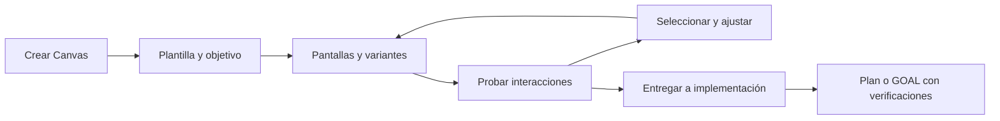

# Canvas: evolución hacia diseño interactivo

Investigación del 8 de septiembre de 2026. Este documento conserva la investigación y la propuesta original. El núcleo de las etapas 1–5 está implementado en el código de desarrollo; el alcance efectivo, los contratos, las pruebas y las ampliaciones pendientes están en [Canvas de OpenIDE](../canvas.md). Las correcciones de novedades y del control del subagente son cambios independientes ya realizados.

## Decisión recomendada

Convertir Canvas en una superficie de creación con tres usos visibles: **Explicar**, **Diseñar** y **Probar**. Conservar los archivos `.canvas.tsx` actuales y sumar un documento estructurado para diseños editables. Mantener el mismo proyecto al pasar de un wireframe a un prototipo y de allí a una tarea de implementación.

La diferencia útil de la referencia de Claude Design es el recorrido completo: partir de una intención, elegir una base, explorar variantes, cambiar elementos concretos y entregar el diseño al agente. Una galería sola no resuelve ese recorrido.

## Qué aportan las referencias

- **Claude Design:** combina creación de prototipos, comentarios sobre elementos, edición directa, controles de ajuste y aplicación de un sistema de diseño. También documenta exportación y entrega a Claude Code. Adoptaría ese recorrido, sin asumir acceso a su implementación interna. Las plantillas concretas de la captura son evidencia de la interfaz aportada por el usuario; no son una API pública que OpenIDE pueda importar. [Presentación oficial](https://www.anthropic.com/news/claude-design-anthropic-labs).
- **Cursor:** su navegador permite inspeccionar una interfaz, comparar capturas y verificar formularios, diseño adaptable y errores. OpenIDE ya tiene una base similar de navegador y selección de elementos: conviene conectar diseño e implementación con ese verificador. [Browser](https://cursor.com/docs/agent/tools/browser).
- **Penpot:** modela prototipos como pantallas conectadas, con disparadores, navegación, overlays y puntos de entrada. Su sistema de tokens separa decisiones visuales reutilizables de los elementos concretos. Adoptaría pantallas, conexiones y tokens como datos propios de OpenIDE. [Prototipos](https://help.penpot.app/user-guide/prototyping-testing/prototyping/), [tokens](https://help.penpot.app/user-guide/design-systems/design-tokens/).
- **tldraw:** distingue el documento persistente de la sesión del usuario —cámara, selección y estado de interfaz— y contempla migraciones de esquema. Esa separación evita guardar zoom o selección como cambios del diseño. Usaría sus patrones como referencia; su SDK requiere una licencia válida para producción y no debe incorporarse como si fuera una dependencia MIT. [Persistencia](https://tldraw.dev/docs/persistence), [licencia del SDK](https://tldraw.dev/community/license).
- **Excalidraw:** permite observar cambios de escena y añadir metadatos por elemento. Es un candidato para una futura pizarra de bocetos, pero una escena de dibujo no sustituye por sí sola un prototipo HTML con formularios. [API del componente](https://docs.excalidraw.com/docs/@excalidraw/excalidraw/api/props/).

## Lo que OpenIDE ya tiene

La evidencia está en estos componentes locales:

- [CanvasService](../../vscode/src/vs/workbench/contrib/openideAgent/browser/openideCanvasService.ts): escritura, lectura, listado y transpilación de un TSX en `.openide/canvases/`.
- [CanvasRuntime](../../vscode/src/vs/workbench/contrib/openideAgent/browser/openideCanvasRuntime.ts): renderer JSX propio, estado por clave, inputs, botones, selección, gráficos y primitivas de wireframe. No es React completo.
- [CanvasEditor](../../vscode/src/vs/workbench/contrib/openideAgent/browser/openideCanvasEditor.ts): webview aislado, recarga del archivo y estado adyacente `.canvas.data.json`. También reenvía selecciones y prompts al chat.
- [CanvasHtml](../../vscode/src/vs/workbench/contrib/openideAgent/browser/openideCanvasHtml.ts): política de contenido sin red y controles de selección/presentación.
- [Skill incorporada](../../vscode/src/vs/workbench/contrib/openideAgent/browser/openideAgentSkills.ts): guía de creación que el harness puede cargar.
- [Exposición externa](../../vscode/src/vs/workbench/contrib/openideAgent/common/openideIdeExposure.ts) y [catálogo de capacidades](../../vscode/src/vs/platform/openideAgentHost/common/openideCapabilityCatalog.ts): Canvas no está registrado como familia para CLIs externos. El harness nativo sí registra `canvas_write/read/list/open` en [AgentService](../../vscode/src/vs/workbench/contrib/openideAgent/browser/openideAgentService.ts).

## Obstáculos que conviene resolver primero

1. **Instrucciones demasiado restrictivas.** La skill pide contenido genérico y wireframes incluso al hablar de mockups, además de exigir colores del IDE para todo. Eso ayuda a un esquema, pero limita diseños de producto con marca propia. Separar instrucciones de wireframe, mockup y análisis; el tema del IDE debe vestir los controles del editor, mientras que el prototipo usa los tokens del proyecto.
2. **Interacción frágil.** `render()` usa `root.replaceChildren(...)` en cada actualización. El código elimina la identidad DOM de inputs, selección y captura de puntero. Es un riesgo directo para escritura continua y sliders; debe medirse con una prueba de foco/selección y resolverse antes de ofrecer ajustes finos. Este hallazgo procede de inspección de código, no de una prueba funcional del formulario.
3. **Validación incompleta.** `transpileModule` comprueba sintaxis y transforma TSX; no equivale a un chequeo semántico del SDK. Importaciones permitidas se manipulan con regex y no se comprueba que cada export exista. Hace falta analizar el AST, validar la API y diferenciar errores de compilación de errores de ejecución. No anunciar “TypeScript válido” como prueba de interacción correcta.
4. **Persistencia poco observable.** Los errores de escritura de estado se absorben y no se muestran al usuario. Cada cambio envía el estado completo; el editor necesita agrupar escrituras, confirmar una revisión y mostrar guardado/error/reintento. La recarga asíncrona también necesita una generación por recurso para descartar resultados viejos.
5. **Edición visual sin contrato de cambios.** Hoy seleccionar un elemento manda selector, HTML y estilos al chat. No hay un documento de nodos con IDs estables, historial de operaciones ni comentarios anclados a una revisión. Modificar CSS/TSX arbitrario por posición es frágil.
6. **Creación sin una entrada visible dedicada.** Hay apertura de archivos y herramientas del harness, pero falta un flujo de elegir intención, plantilla, fidelidad, dispositivo y sistema de diseño.
7. **Experiencia CLI incompleta.** La disponibilidad del Canvas nativo no garantiza que Codex, Claude u otro CLI lo descubran. No alcanza con añadir una frase al prompt: deben existir las herramientas, los permisos y los recibos del mismo servicio.

## Flujo de producto propuesto

**Entrada:** `+ → Canvas`, comando “Canvas: Crear” y prompt natural, por ejemplo “haceme un wireframe de checkout móvil”. La galería presenta miniaturas estáticas ligeras; no monta un runtime por tarjeta. Inicialmente: wireframe web, aplicación móvil, mockup de interfaz, presentación, documento/análisis y lienzo libre. El objetivo solicitado permite preseleccionar una plantilla sin iniciar un modelo ni escribir archivos hasta confirmar Crear.

**Editor:** a la izquierda pantallas/variantes; al centro preview; a la derecha propiedades del elemento seleccionado. Arriba, Probar/Diseñar, tamaño móvil/tablet/escritorio, deshacer/rehacer y estado de guardado. En Probar, los clics ejecutan las interacciones del prototipo. En Diseñar, seleccionan nodos. Mantener accesos por teclado y un inspector equivalente al arrastre.

**Interactividad mínima:** navegación entre pantallas, volver, tabs, formularios locales, estados de error/éxito, abrir/cerrar un modal y filtros. Cada acción visible debe tener comportamiento local o indicación explícita de que es una representación. Ninguna interacción de prototipo implica por sí misma enviar un prompt o ejecutar herramientas del host.

**Ajustes:** texto, distribución, espaciado, tamaños y tokens; el cambio se ve al instante, queda como operación reversible y puede enviarse al agente con revisión y nodo de origen. Las variantes se comparan dentro del mismo documento. Los comentarios permanecen anclados al nodo aunque cambie su posición.

**Entrega:** generar un resumen de pantallas, transiciones, tokens, componentes reales candidatos y criterios de aceptación. El botón “Implementar” prepara un Plan o GOAL editable. GOAL verifica el código resultante en el navegador y registra archivos/evidencias; ver una pantalla bonita no completa el objetivo.

## Contrato técnico propuesto

Conservar `.canvas.tsx` para artefactos libres existentes. Agregar un formato de diseño versionado, por ejemplo `.openide/designs/<id>/design.json`, con `schemaVersion`, `revision`, pantallas, nodos con ID, propiedades, interacciones y referencias a assets/tokens. El preview de diseños estructurados es una proyección; no mantener JSON y TSX generado como dos fuentes que cualquiera pueda editar sin reconciliación.

- `DESIGN.md`: intención, público, flujos, criterios y decisiones humanas/IA. Se puede editar, como Plan/GOAL.
- `design.json`: estructura ejecutable y revisiones; operaciones como `setProperty`, `moveNode`, `addScreen` y `connectAction` con `expectedRevision`.
- `tokens.json`: decisiones visuales del proyecto; referencias estables y valores de fallback. Asociar al repositorio antes de proponer importación de CSS o bibliotecas externas.
- Estado personal de cámara, selección y paneles: almacenamiento del IDE, fuera del documento versionado.
- Assets: archivos locales validados y servidos por el webview con raíces limitadas. Mantener la política sin red; una importación explícita del usuario pasa por el host.
- Historial: operaciones agrupadas por gesto, undo/redo y rechazo de cambios sobre una revisión vieja. Una modificación del agente también es una operación atribuida.

Para documentos estructurados, un renderer declarativo puede actualizar nodos estables sin reemplazar todo el DOM. Para TSX libre, evaluar React/Preact empaquetado localmente y cargado bajo demanda, con una capa compatible del SDK. Medir primero; no añadir un editor de pizarra pesado al arranque del IDE.

## Harness, CLIs, memoria y mapa

Exponer progresivamente `canvas_list/read/open`, `canvas_templates`, `canvas_create`, `canvas_patch`, `canvas_inspect` y `canvas_preview` a través del servicio común. El catálogo debe describir intenciones en lenguaje natural y devolver el esquema/capacidades soportadas. Son APIs propuestas: no están disponibles todavía.

Las mutaciones requieren el puente de permisos del IDE y recibos con recurso/revisión. El comentario de `openideIdeExposure.ts` advierte precisamente que el MCP externo evita el flujo de aprobación nativo; no ensanchar la allowlist sin resolver esa diferencia. Reutilizar la conexión CLI existente y no acoplar el documento a una marca de CLI.

En Project Map, proyectar nodos de diseño/pantalla y relaciones con componentes y archivos reales. La proyección es derivada. Memoria guarda decisiones duraderas verificadas —por qué se eligió un flujo o componente—, con referencias a diseño/GOAL; no copia cada gesto. El informe del GOAL enlaza una revisión de diseño y sus pruebas.

## Orden de implementación y aceptación

1. **Estabilizar Canvas actual:** renderer, validación de imports, estado con confirmación y errores, cancelación de recargas antiguas. Aceptación: escribir sin perder foco/cursor, cambiar un slider sin cortar el gesto y recuperar estado después de reiniciar.
2. **Creación y descubrimiento:** galería inicial, fidelidad/dispositivo, prompts específicos y contratos comunes para CLIs. Aceptación: crear desde interfaz y desde un CLI real termina en el mismo recurso, abierto y editable, con permisos equivalentes.
3. **Diseño estructurado:** IDs estables, pantallas, inspector, tokens, operaciones y undo/redo. Aceptación: modificar un elemento, deshacer, rehacer y rechazar un parche desactualizado sin perder trabajo.
4. **Prototipos y entrega:** flujos, escenarios, comentarios, variantes y Plan/GOAL. Aceptación: completar un recorrido móvil y de escritorio, señalar un fallo y verificar su corrección en el código real.
5. **Exportación y ampliaciones:** HTML independiente, capturas y posteriormente PDF/presentaciones; pizarra libre, animación y 3D después de contar con pruebas y presupuesto de recursos. No mostrar esas plantillas como disponibles hasta que la generación, edición y exportación funcionen.

Pruebas de rendimiento propuestas: tiempo de apertura fría/caliente, latencia de interacción p95, cantidad de escrituras durante un gesto, memoria de una pestaña y liberación al cerrarla. Medir 1, 10 y 50 pantallas con previews inactivos suspendidos. Son escenarios de validación, no resultados medidos en esta investigación.

## Actualización de implementación · 2026-09-08

Las APIs propuestas arriba están implementadas en el servicio común y el puente MCP, incluidas `canvas_import` y `canvas_export`. Las mutaciones de Canvas usan la aprobación nativa. El editor incluye las nueve plantillas, assets locales, importación de tokens, PDF/PPTX/SVG/OBJ y proyección derivada en Project Map. Los formatos y límites actuales están en [Canvas](../canvas.md); este documento conserva el razonamiento original de la investigación.

La validación automatizada usa el IDE real en una pantalla virtual, un cliente MCP externo y procesos separados para los exports autónomos. La escena de 30 objetos y 7680 triángulos se creó y mostró en aproximadamente 0,9 segundos en el equipo de desarrollo; incluye el recorrido MCP y no es una medición p95 universal. Las exportaciones PDF se renderizaron con Poppler y las de PowerPoint se abrieron en LibreOffice además de verificarse como OOXML editable.
